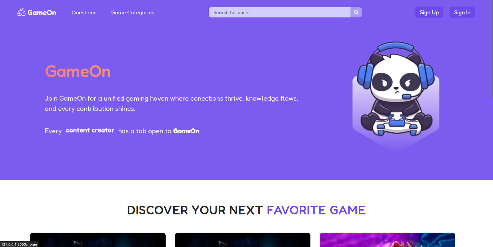
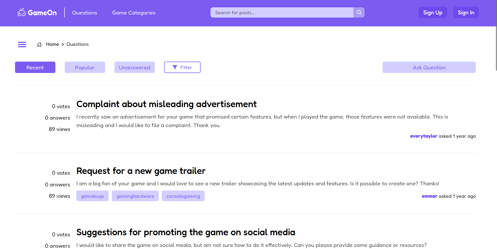
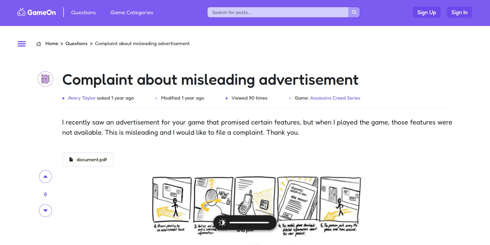
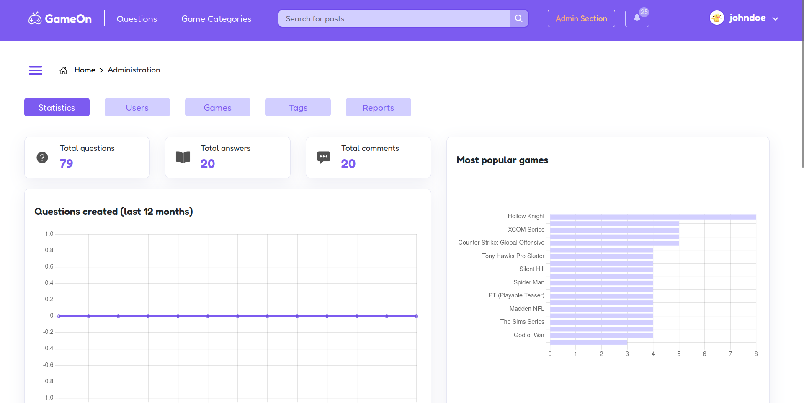

# GameOn

GameOn is committed to revolutionizing the online gaming landscape by creating a dynamic, unified platform that fosters collaboration, encourages knowledge-sharing, and celebrates gamers' contributions. In a world where information fragmentation and community engagement challenges persist, GameOn aims to be the go-to destination for gamers seeking connection and recognition within the gaming ecosystem.

## Project Components

* [ER: Requirements Specification](../docs/er.md)
* [EBD: Database Specification](../docs/edb.md)
* [EAP: Architecture Specification and Prototype](../docs/eap.md)
* [PA: Product and Presentation](../docs/pa.md)

## Artefacts Checklist

* The artefacts checklist is available at: <docs.google.com/spreadsheets @ g.uporto>

## Demo

[Watch the demo](images/demo.mp4)

## Team

* Ana Azevedo, up202108654@up.pt
* Catarina Canelas, up202103628@up.pt
* Gabriel Ferreira, up202108722@up.pt
* Luís Du, up202105385@up.pt

***
GROUP23143, 22/09/2023
