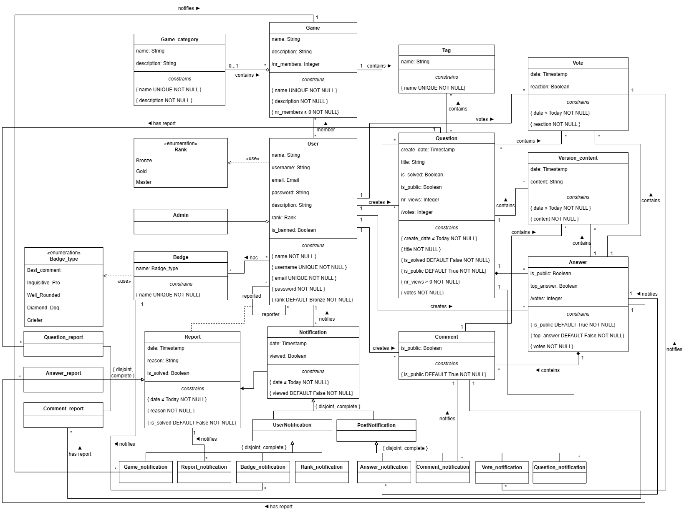

# EBD: Database Specification Component

## A4: Conceptual Data Model

This section contains the identification and description of the entities and relationships that exist to the GameOn project and its database specification.

### 1. Class diagram

> UML class diagram containing the classes, associations, multiplicity and roles.  
> For each class, the attributes, associations and constraints are included in the class diagram.

Figure 7: GameOn conceptual data model in UML

### 2. Additional Business Rules
 
Additional business rules and restrictions that cannot be conveyed in the UML class diagram of GameOn system.

| Identifier | Name                                  | Description                                                                                                                                              |
| ---------- | ------------------------------------- | -------------------------------------------------------------------------------------------------------------------------------------------------------- |
| BR13       | Unique Association of Version_content | Version_content can be associated with either a question, a comment, or an answer at a time, but not with more than one of these classes simultaneously. |
| BR14       | Unique Association of Vote            | Vote can be associated with either a question or an answer at a time, but not with more than one of these classes simultaneously.                        |
| BR15       | Self-Reporting Prohibition            | A user cannot report themselves.                                                                                                                         |
| BR16       | Chronological Order of Post Elements  | The date of each question is always before its answers, comments and votes.                                                                              |
| BR17       | Single Vote Limitation                | A user can only vote on a question or answer once.                                                                                                       |
| BR18       | Self-Voting Prohibition               | A user cannot vote on its own questions or answers.                                                                                                      |
| BR19       | Private posts                         | A user cannot vote, answer nor comment on posts that are not public.                                                                                     |
| BR20       | Banned accounts                       | Users whose accounts are banned cannot vote, answer nor comment on any existing post.                                                                    |

Table 9: Additional Business Rules

## A5: Relational Schema, validation and schema refinement

This section contains the Relational Schema obtained from the Conceptual Data Model. 

The Relational Schema includes the relation schemas, attributes, domains, primary keys, foreign keys and other integrity rules: UNIQUE, DEFAULT, NOT NULL, CHECK.

### 1. Relational Schema

| Relation reference | Relation Compact Notation                                                                                                                                                                                                                                                                                                                                                                                                                                                                                                                                                                                                                                                                                                                                                                                                                                                                                                                                                                                                                                                                                                                                                                                                                                                                                                                                                                                                                                                                                                                                                                                                                                                                                                                                                                                                                                                                                                                                                                                                                                                                                                                                                                                                                                                     |
| ------------------ | ----------------------------------------------------------------------------------------------------------------------------------------------------------------------------------------------------------------------------------------------------------------------------------------------------------------------------------------------------------------------------------------------------------------------------------------------------------------------------------------------------------------------------------------------------------------------------------------------------------------------------------------------------------------------------------------------------------------------------------------------------------------------------------------------------------------------------------------------------------------------------------------------------------------------------------------------------------------------------------------------------------------------------------------------------------------------------------------------------------------------------------------------------------------------------------------------------------------------------------------------------------------------------------------------------------------------------------------------------------------------------------------------------------------------------------------------------------------------------------------------------------------------------------------------------------------------------------------------------------------------------------------------------------------------------------------------------------------------------------------------------------------------------------------------------------------------------------------------------------------------------------------------------------------------------------------------------------------------------------------------------------------------------------------------------------------------------------------------------------------------------------------------------------------------------------------------------------------------------------------------------------------------------- |
| R01                | user(<ins>id</ins>, name **NN**, username **UK NN**, email **UK NN**, password **NN**, description, rank **NN DF** 'Bronze' **CK** rank **IN** Rank)                                                                                                                                                                                                                                                                                                                                                                                                                                                                                                                                                                                                                                                                                                                                                                                                                                                                                                                                                                                                                                                                                                                                                                                                                                                                                                                                                                                                                                                                                                                                                                                                                                                                                                                                                                                                                                                                                                                                                                                                                                                                                                                          |
| R02                | admin(<ins>user_id</ins> -> user)                                                                                                                                                                                                                                                                                                                                                                                                                                                                                                                                                                                                                                                                                                                                                                                                                                                                                                                                                                                                                                                                                                                                                                                                                                                                                                                                                                                                                                                                                                                                                                                                                                                                                                                                                                                                                                                                                                                                                                                                                                                                                                                                                                                                                                             |
| R03                | banned(<ins>user_id</ins> -> user)                                                                                                                                                                                                                                                                                                                                                                                                                                                                                                                                                                                                                                                                                                                                                                                                                                                                                                                                                                                                                                                                                                                                                                                                                                                                                                                                                                                                                                                                                                                                                                                                                                                                                                                                                                                                                                                                                                                                                                                                                                                                                                                                                                                                                                            |
| R04                | badge(<ins>id</ins>, name **UK NN CK** name **IN** Badge_type)                                                                                                                                                                                                                                                                                                                                                                                                                                                                                                                                                                                                                                                                                                                                                                                                                                                                                                                                                                                                                                                                                                                                                                                                                                                                                                                                                                                                                                                                                                                                                                                                                                                                                                                                                                                                                                                                                                                                                                                                                                                                                                                                                                                                                |
| R05                | game_category(<ins>id</ins>, type **UK NN**, description **NN**)                                                                                                                                                                                                                                                                                                                                                                                                                                                                                                                                                                                                                                                                                                                                                                                                                                                                                                                                                                                                                                                                                                                                                                                                                                                                                                                                                                                                                                                                                                                                                                                                                                                                                                                                                                                                                                                                                                                                                                                                                                                                                                                                                                                                              |
| R06                | game(<ins>id</ins>, name **UK NN**, description **NN**, /nr_members **NN CK** nr_members >=0, game_category_id -> game_category)                                                                                                                                                                                                                                                                                                                                                                                                                                                                                                                                                                                                                                                                                                                                                                                                                                                                                                                                                                                                                                                                                                                                                                                                                                                                                                                                                                                                                                                                                                                                                                                                                                                                                                                                                                                                                                                                                                                                                                                                                                                                                                                                              |
| R07                | question(<ins>id</ins>, user_id -> user **NN**, create_date **NN CK** create_date <= Today, title **NN**, is_solved **NN DF** False, is_public **NN DF** True, nr_views **NN CK** nr_views >= 0, /votes **NN**, game_id -> game)                                                                                                                                                                                                                                                                                                                                                                                                                                                                                                                                                                                                                                                                                                                                                                                                                                                                                                                                                                                                                                                                                                                                                                                                                                                                                                                                                                                                                                                                                                                                                                                                                                                                                                                                                                                                                                                                                                                                                                                                                                              |
| R08                | comment(<ins>id</ins>, user_id -> user **NN**, answer_id -> answer **NN**, is_public **NN DF** True)                                                                                                                                                                                                                                                                                                                                                                                                                                                                                                                                                                                                                                                                                                                                                                                                                                                                                                                                                                                                                                                                                                                                                                                                                                                                                                                                                                                                                                                                                                                                                                                                                                                                                                                                                                                                                                                                                                                                                                                                                                                                                                                                                                          |
| R09                | answer(<ins>id</ins>, user_id -> user **NN**, question_id -> question **NN**, is_public **NN DF** True, top_asnwer **NN DF** False, /votes **NN**)                                                                                                                                                                                                                                                                                                                                                                                                                                                                                                                                                                                                                                                                                                                                                                                                                                                                                                                                                                                                                                                                                                                                                                                                                                                                                                                                                                                                                                                                                                                                                                                                                                                                                                                                                                                                                                                                                                                                                                                                                                                                                                                            |
| R10                | vote(<ins>id</ins>, user_id -> user **NN**, date **NN CK** date <= Today, reaction **NN**, vote_type **NN CK** vote_type **IN** Vote_type, answer_id -> answer, question_id -> question,  **CK** ((vote_type = 'Question_vote' **AND** question_id **NN AND** answer_id **NULL**)   **OR** (vote_type = 'Answer_vote' **AND** answer_id **NN AND** question_id **NULL**)))                                                                                                                                                                                                                                                                                                                                                                                                                                                                                                                                                                                                                                                                                                                                                                                                                                                                                                                                                                                                                                                                                                                                                                                                                                                                                                                                                                                                                                                                                                                                                                                                                                                                                                                                                                                                                                                                                              |
| R11                | tag(<ins>id</ins>, name **UK NN**)                                                                                                                                                                                                                                                                                                                                                                                                                                                                                                                                                                                                                                                                                                                                                                                                                                                                                                                                                                                                                                                                                                                                                                                                                                                                                                                                                                                                                                                                                                                                                                                                                                                                                                                                                                                                                                                                                                                                                                                                                                                                                                                                                                                                                                            |
| R12                | version_content(<ins>id</ins>, date **NN CK** date <= Today, content **NN**, content_type **NN CK** content_type **IN** Content_type, question_id -> question, answer_id -> answer, comment_id -> comment,  **CK** ((content_type = 'Question_content' **AND** question_id **NN AND** answer_id **NULL AND** comment_id **NULL**)  **OR** (report_type = 'Answer_content' **AND** answer_id **NN AND** question_id **NULL AND** comment_id **NULL**),   **OR** (report_type = 'Comment_content' **AND** comment_id **NN AND** question_id **NULL AND** answer_id **NULL**)))                                                                                                                                                                                                                                                                                                                                                                                                                                                                                                                                                                                                                                                                                                                                                                                                                                                                                                                                                                                                                                                                                                                                                                                                                                                                                                                                                                                                                                                                                                                                                                                                                                                                                         |
| R13                | report(<ins>id</ins>, date **NN CK** date <= Today, reason **NN**, is_solved **NN DF** False, reporter_id -> user **NN**, reported_id -> user **NN**, report_type **NN CK** report_type **IN** Report_type, question_id -> question, answer_id -> answer, comment_id -> comment,    **CK** (reported_id <> reporter_id) **AND** ((report_type = 'Question_report' **AND** question_id **NN AND** answer_id **NULL AND** comment_id **NULL**)   **OR** (report_type = 'Answer_report' **AND** answer_id **NN AND** question_id **NULL AND** comment_id **NULL**),   **OR** (report_type = 'Comment_report' **AND** comment_id **NN AND** question_id **NULL AND** answer_id **NULL**)))                                                                                                                                                                                                                                                                                                                                                                                                                                                                                                                                                                                                                                                                                                                                                                                                                                                                                                                                                                                                                                                                                                                                                                                                                                                                                                                                                                                                                                                                                                                                                                                                                    |
| R14                | notification(<ins>id</ins>, date **NN CK** date <= Today, viewed **NN DF** False, user_id -> user **NN**, notification_type **NN CK** notification_type **IN** Notification_type, question_id -> question, answer_id -> answer, comment_id -> comment, vote_id -> vote, report_id -> report, badge_id -> badge, game_id -> game,  **CK** ((notification_type = 'Report_notification' **AND** report_id **NN AND** question_id **NULL AND** answer_id **NULL AND** comment_id **NULL AND** vote_id **NULL AND** bagde_id **NULL AND** game_id **NULL**)  **OR** (notification_type = 'Question_notification' **AND** question_id **NN AND** report_id **NULL AND** answer_id **NULL AND** comment_id **NULL AND** vote_id **NULL AND** bagde_id **NULL AND** game_id **NULL**)             **OR** (notification_type = 'Answer_notification' **AND** answer_id **NN AND** report_id **NULL AND** question_id **NULL AND** comment_id **NULL AND** vote_id **NULL AND** bagde_id **NULL AND** game_id **NULL**)           **OR** (notification_type = 'Comment_notification' **AND** comment_id **NN AND** report_id **NULL AND** answer_id **NULL AND** question_id **NULL AND** vote_id **NULL AND** bagde_id **NULL AND** game_id **NULL**)      **OR** (notification_type = 'Vote_notification' **AND** vote_id **NN AND** report_id **NULL AND** answer_id **NULL AND** comment_id **NULL AND** question_id **NULL AND** bagde_id **NULL AND** game_id **NULL**)                 **OR** (notification_type = 'Rank_notification' **AND** question_id **NULL AND** report_id **NULL AND** answer_id **NULL AND** comment_id **NULL AND** vote_id **NULL AND** bagde_id **NULL AND** game_id **NULL**)                                                                                       **OR** (notification_type = 'Badge_notification' **AND** badge_id **NN AND** question_id **NULL AND** report_id **NULL AND** answer_id **NULL AND** comment_id **NULL AND** vote_id **NULL AND** game_id **NULL**)   **OR** (notification_type = 'Game_notification' **AND** game_id **NN AND** question_id **NULL AND** report_id **NULL AND** answer_id **NULL AND** comment_id **NULL AND** vote_id **NULL AND** bagde_id **NULL**)               )) |
| R15                | user_badge(<ins>user_id</ins> -> user, <ins>badge_id</ins> -> badge)                                                                                                                                                                                                                                                                                                                                                                                                                                                                                                                                                                                                                                                                                                                                                                                                                                                                                                                                                                                                                                                                                                                                                                                                                                                                                                                                                                                                                                                                                                                                                                                                                                                                                                                                                                                                                                                                                                                                                                                                                                                                                                                                                                                                          |
| R16                | game_member(<ins>user_id</ins> -> user, <ins>game_id</ins> -> game)                                                                                                                                                                                                                                                                                                                                                                                                                                                                                                                                                                                                                                                                                                                                                                                                                                                                                                                                                                                                                                                                                                                                                                                                                                                                                                                                                                                                                                                                                                                                                                                                                                                                                                                                                                                                                                                                                                                                                                                                                                                                                                                                                                                                           |
| R17                | question_tag(<ins>question_id</ins> -> question, <ins>tag_id</ins> -> tag)                                                                                                                                                                                                                                                                                                                                                                                                                                                                                                                                                                                                                                                                                                                                                                                                                                                                                                                                                                                                                                                                                                                                                                                                                                                                                                                                                                                                                                                                                                                                                                                                                                                                                                                                                                                                                                                                                                                                                                                                                                                                                                                                                                                                    |  |

Table 10: GameOn Relational Schema

Legend:

- UK = UNIQUE;
- NN = NOT NULL;
- DF = DEFAULT;
- CK = CHECK;

### 2. Domains

Specification of additional domains:  

| Domain Name       | Domain Specification                                                                                                                                                                      |
| ----------------- | ----------------------------------------------------------------------------------------------------------------------------------------------------------------------------------------- |
| Today             | DATE DEFAULT CURRENT_DATE                                                                                                                                                                 |
| Rank              | ENUM ('Bronze', 'Gold', 'Master')                                                                                                                                                         |
| Badge_type        | ENUM ('Best_comment', 'Inquisitive_Pro', 'Well_Rounded', 'Diamond_Dog', 'Griefer')                                                                                                                                                              |
| Notification_type | ENUM ('Report_notification', 'Rank_notification', 'Badge_notification', 'Answer_notification', 'Question_notification', 'Comment_notification', 'Vote_notification', 'Game_notification') |
| Report_type       | ENUM ('Question_report', 'Answer_report', 'Comment_report')                                                                                                                               |
| Vote_type         | ENUM ('Question_vote', 'Answer_vote')                                                                                                                                                     |
| Content_type      | ENUM ('Question_content', 'Answer_content', 'Comment_content')                                                                                                                            |

Table 11: GameOn Domains

### 3. Schema validation

All functional dependencies are identified and the normalization of all relation schemas is accomplished.

| **TABLE R01**                | user                                                         |
| ---------------------------- | ------------------------------------------------------------ |
| **Keys**                     | { id }, { username }, { email }                              |
| **Functional Dependencies:** |                                                              |
| FD0101                       | id → { name, username, email, password, description, rank }  |
| FD0102                       | username →  { id, name, email, password, description, rank } |
| FD0103                       | email →  { id, name, username, password, description, rank } |
| **NORMAL FORM**              | BCNF                                                         |

Table 12: user schema validation

| **TABLE R02**                | admin       |
| ---------------------------- | ----------- |
| **Keys**                     | { user_id } |
| **Functional Dependencies:** | none        |
| **NORMAL FORM**              | BCNF        |

Table 13: admin schema validation

| **TABLE R03**                | banned      |
| ---------------------------- | ----------- |
| **Keys**                     | { user_id } |
| **Functional Dependencies:** | none        |
| **NORMAL FORM**              | BCNF        |

Table 14: banned schema validation

| **TABLE R04**                | badge            |
| ---------------------------- | ---------------- |
| **Keys**                     | { id }, { name } |
| **Functional Dependencies:** |                  |
| FD0301                       | id → { name }    |
| FD0302                       | name →  { id }   |
| **NORMAL FORM**              | BCNF             |

Table 15: badge schema validation

| **TABLE R05**                | game_category               |
| ---------------------------- | --------------------------- |
| **Keys**                     | { id }, { type }            |
| **Functional Dependencies:** |                             |
| FD0501                       | id → { type, description }  |
| FD0502                       | type →  { id, description } |
| **NORMAL FORM**              | BCNF                        |

Table 16: game_category schema validation

| **TABLE R06**                | game                                                      |
| ---------------------------- | --------------------------------------------------------- |
| **Keys**                     | { id }, { name }                                          |
| **Functional Dependencies:** |                                                           |
| FD0601                       | id → { name, description, nr_members, game_category_id }  |
| FD0602                       | name →  { id, description, nr_members, game_category_id } |
| **NORMAL FORM**              | BCNF                                                      |

Table 17: game schema validation

| **TABLE R07**                | question                                                                             |
| ---------------------------- | ------------------------------------------------------------------------------------ |
| **Keys**                     | { id }                                                                               |
| **Functional Dependencies:** |                                                                                      |
| FD0701                       | id → { user_id, create_date, title, is_solved, is_public, nr_views, votes, game_id } |
| **NORMAL FORM**              | BCNF                                                                                 |

Table 18: question schema validation

| **TABLE R08**                | comment                                |
| ---------------------------- | -------------------------------------- |
| **Keys**                     | { id }                                 |
| **Functional Dependencies:** |                                        |
| FD0801                       | id → { user_id, answer_id, is_public } |
| **NORMAL FORM**              | BCNF                                   |

Table 19: comment schema validation

| **TABLE R09**                | answer                                                      |
| ---------------------------- | ----------------------------------------------------------- |
| **Keys**                     | { id }                                                      |
| **Functional Dependencies:** |                                                             |
| FD0901                       | id → { user_id, question_id, is_public, top_answer, votes } |
| **NORMAL FORM**              | BCNF                                                        |

Table 20: answer schema validation

| **TABLE R10**                | vote                                                                            |
| ---------------------------- | ------------------------------------------------------------------------------- |
| **Keys**                     | { id }                                                                          |
| **Functional Dependencies:** |                                                                                 |
| FD1001                       | id → { user_id, date, reaction, vote_type, question_id, answer_id, comment_id } |
| **NORMAL FORM**              | BCNF                                                                            |

Table 21: vote schema validation

| **TABLE R11**                | tag              |
| ---------------------------- | ---------------- |
| **Keys**                     | { id }, { name } |
| **Functional Dependencies:** |                  |
| FD1101                       | id → { name }    |
| FD1101                       | name → { id }    |
| **NORMAL FORM**              | BCNF             |

Table 22: tag schema validation

| **TABLE R12**                | version_content                                                          |
| ---------------------------- | ------------------------------------------------------------------------ |
| **Keys**                     | { id }                                                                   |
| **Functional Dependencies:** |                                                                          |
| FD1201                       | id → { date, content, content_type, question_id, answer_id, comment_id } |
| **NORMAL FORM**              | BCNF                                                                     |

Table 23: version_content schema validation

| **TABLE R13**                | report                                                                                                      |
| ---------------------------- | ----------------------------------------------------------------------------------------------------------- |
| **Keys**                     | { id }                                                                                                      |
| **Functional Dependencies:** |                                                                                                             |
| FD1301                       | id → { date, reason, is_solved, reporter_id, reported_id, report_type, question_id, answer_id, comment_id } |
| **NORMAL FORM**              | BCNF                                                                                                        |

Table 24: report schema validation

| **TABLE R14**                | notification                                                                                                                 |
| ---------------------------- | ---------------------------------------------------------------------------------------------------------------------------- |
| **Keys**                     | { id }                                                                                                                       |
| **Functional Dependencies:** |                                                                                                                              |
| FD1401                       | id → { date, viewed, user_id, notification_type, question_id, answer_id, comment_id, vote_id, report_id, badge_id, game_id } |
| **NORMAL FORM**              | BCNF                                                                                                                         |

Table 25: notification schema validation

| **TABLE R15**                | user_badge            |
| ---------------------------- | --------------------- |
| **Keys**                     | { user_id, badge_id } |
| **Functional Dependencies:** | none                  |
| **NORMAL FORM**              | BCNF                  |

Table 26: user_badge schema validation

| **TABLE R16**                | game_member          |
| ---------------------------- | -------------------- |
| **Keys**                     | { user_id, game_id } |
| **Functional Dependencies:** | none                 |
| **NORMAL FORM**              | BCNF                 |

Table 27: game_member schema validation

| **TABLE R17**                | question_tag            |
| ---------------------------- | ----------------------- |
| **Keys**                     | { question_id, tag_id } |
| **Functional Dependencies:** | none                    |
| **NORMAL FORM**              | BCNF                    |

Table 28: question_tag schema validation

Because all relations are in the Boyce–Codd Normal Form (BCNF), the relational schema is also in the BCNF and, therefore, the schema does not need to be further normalized.

---

## A6: Indexes, triggers, transactions and database population

### 1. Database Workload
 

| **Relation reference** | **Relation Name** | **Order of magnitude** | **Estimated growth** |
| ---------------------- | ----------------- | ---------------------- | -------------------- |
| R01                    | user              | 100 k                  | 100 / day            |
| R02                    | admin             | 100                    | 10 / year            |
| R03                    | banned            | 1 k                    | 10 / month           |
| R04                    | badge             | 10                     | no growth            |
| R05                    | game_category     | 100                    | 1 / month            |
| R06                    | game              | 1 k                    | 10 / month           |
| R07                    | question          | 1 M                    | 1 k / day            |
| R08                    | comment           | 100 k                  | 100 / day            |
| R09                    | answer            | 1 M                    | 1 k / day            |
| R10                    | vote              | 10 M                   | 1 k / day            |
| R11                    | tag               | 100                    | 1 / day              |
| R12                    | version_content   | 10 M                   | 1 k / day            |
| R13                    | report            | 10 k                   | 100 / week           |
| R14                    | notification      | 10 M                   | 10 k  / day          |
| R15                    | user_badge        | 100 k                  | 100 / day            |
| R16                    | game_member       | 100 k                  | 100 / day            |
| R17                    | question_tag      | 10 M                   | 1 k / day            |

Table 29: GameOn workload

### 2. Proposed Indices

#### 2.1. Performance Indices
 
Performance indexes are applied to improve the performance of select queries.

| **Index**         | IDX01                                                                                                                                                                                                                                                                                                                                          |
| ----------------- | ---------------------------------------------------------------------------------------------------------------------------------------------------------------------------------------------------------------------------------------------------------------------------------------------------------------------------------------------- |
| **Relation**      | question                                                                                                                                                                                                                                                                                                                                       |
| **Attribute**     | user_id                                                                                                                                                                                                                                                                                                                                        |
| **Type**          | Hash                                                                                                                                                                                                                                                                                                                                           |
| **Cardinality**   | medium                                                                                                                                                                                                                                                                                                                                         |
| **Clustering**    | no                                                                                                                                                                                                                                                                                                                                             |
| **Justification** | Table 'question' is very large. Several queries need to frequently filter access to the questions by its author (user). Filtering is done by exact match, thus an hash type index would be best suited. Considering the high update frequency, clustering the table is not proposed, as it would introduce additional overhead during updates. |
| **SQL Code**      | CREATE INDEX question_author ON question USING hash (user_id);                                                                                                                                                                                                                                                                                 |

Table 30: question_author index

| **Index**         | IDX02                                                                                                                                                                                                                                                                                                                                                                           |
| ----------------- | ------------------------------------------------------------------------------------------------------------------------------------------------------------------------------------------------------------------------------------------------------------------------------------------------------------------------------------------------------------------------------- |
| **Relation**      | question                                                                                                                                                                                                                                                                                                                                                                        |
| **Attribute**     | create_date                                                                                                                                                                                                                                                                                                                                                                     |
| **Type**          | B-tree                                                                                                                                                                                                                                                                                                                                                                          |
| **Cardinality**   | medium                                                                                                                                                                                                                                                                                                                                                                          |
| **Clustering**    | no                                                                                                                                                                                                                                                                                                                                                                              |
| **Justification** | Table 'question' is frequently accessed based on the create date of each post. Implementing a B-tree index on the 'create_date' attribute enhances the efficiency of date range queries, optimizing the performance of these operations. Considering the high update frequency, clustering the table is not proposed, as it would introduce additional overhead during updates. |  |
| **SQL Code**      | CREATE INDEX question_post_date ON question USING btree (create_date);                                                                                                                                                                                                                                                                                                          |

Table 31: question_post_date index 

| **Index**         | IDX03                                                                                                                                                                                                                                                                                                                                                                                                                                                                        |
| ----------------- | ---------------------------------------------------------------------------------------------------------------------------------------------------------------------------------------------------------------------------------------------------------------------------------------------------------------------------------------------------------------------------------------------------------------------------------------------------------------------------- |
| **Relation**      | game                                                                                                                                                                                                                                                                                                                                                                                                                                                                         |
| **Attribute**     | nr_members                                                                                                                                                                                                                                                                                                                                                                                                                                                                   |
| **Type**          | B-tree                                                                                                                                                                                                                                                                                                                                                                                                                                                                       |
| **Cardinality**   | medium                                                                                                                                                                                                                                                                                                                                                                                                                                                                       |
| **Clustering**    | no                                                                                                                                                                                                                                                                                                                                                                                                                                                                           |
| **Justification** | Table 'game' is frequently accessed and displayed based on the number of members, making 'nr_members' a critical attribute for query performance. Creating a B-tree index on 'nr_members' enables efficient querying and sorting operations, especially when the application needs to display games ordered by the number of members. Considering the high update frequency, clustering the table is not proposed, as it would introduce additional overhead during updates. |
| **SQL Code**      | CREATE INDEX game_nr_members ON game USING btree (nr_members);                                                                                                                                                                                                                                                                                                          |

Table 32: game_nr_members index                                               

#### 2.2. Full-text Search Indices 

To improve text search time, we created Full-Text Search (FTS) indexes on the tables and attributes we thought would be queried the most. Those indexes can be found in the following tables:  

<table>
  <tr>
    <th>Index</th>
    <th>IDX04</th>
  </tr>
  <tr>
    <td><b>Relation</b></td>
    <td>question</td>
  </tr>
  <tr>
    <td><b>Attribute</b></td>
    <td>title</td>
  </tr>
  <tr>
    <td><b>Type</b></td>
    <td>GIN</td>
  </tr>
  <tr>
    <td><b>Clustering</b></td>
    <td>No</td>
  </tr>
  <tr>
    <td><b>Justification</b></td>
    <td>To provide full-text search features to look for questions based on matching titles. The index type is GIN because the indexed fields are not expected to change often.</td>
  </tr>
  <tr>
    <td><b>SQL code</b></td>
    <td>
      <pre>
-- Add column to question to store computed ts_vectors.
ALTER TABLE question
ADD COLUMN tsvectors TSVECTOR;

-- Create a function to automatically update ts_vectors.
CREATE FUNCTION question_search_update() RETURNS TRIGGER AS $$ 
BEGIN
  IF TG_OP = 'INSERT' THEN 
    NEW.tsvectors = setweight(to_tsvector('english', NEW.title), 'A');
  END IF; 
  IF TG_OP = 'UPDATE' THEN 
    IF (NEW.title <> OLD.title) THEN 
      NEW.tsvectors = setweight(to_tsvector('english', NEW.title), 'A');
    END IF;
  END IF;
  RETURN NEW;
END $$ LANGUAGE plpgsql;

-- Create a trigger before insert or update on question.
CREATE TRIGGER question_search_update 
BEFORE INSERT OR UPDATE ON question 
FOR EACH ROW 
EXECUTE PROCEDURE question_search_update();

-- Finally, create a GIN index for ts_vectors.
CREATE INDEX search_question ON question USING GIN (tsvectors);
      </pre>
    </td>
  </tr>
</table>

Table 33: search_question index 

<table>
  <tr>
    <th>Index</th>
    <th>IDX05</th>
  </tr>
  <tr>
    <td><b>Relation</b></td>
    <td>version_content</td>
  </tr>
  <tr>
    <td><b>Attribute</b></td>
    <td>content</td>
  </tr>
  <tr>
    <td><b>Type</b></td>
    <td>GIN</td>
  </tr>
  <tr>
    <td><b>Clustering</b></td>
    <td>No</td>
  </tr>
  <tr>
    <td><b>Justification</b></td>
    <td>To provide full-text search features to look for all types of posts on matching content. The index type is GIN because the indexed fields are not expected to change often.</td>
  </tr>
  <tr>
    <td><b>SQL code</b></td>
    <td>
      <pre>
-- Add column to content to store computed ts_vectors.
ALTER TABLE content
ADD COLUMN tsvectors TSVECTOR;

-- Create a function to automatically update ts_vectors.
CREATE FUNCTION content_search_update() RETURNS TRIGGER AS $$ 
BEGIN
  IF TG_OP = 'INSERT' THEN 
    NEW.tsvectors = setweight(to_tsvector('english', NEW.content), 'A');
  END IF; 
  IF TG_OP = 'UPDATE' THEN 
    IF (NEW.title <> OLD.title) THEN 
      NEW.tsvectors = setweight(to_tsvector('english', NEW.content), 'A');
    END IF;
  END IF;
  RETURN NEW;
END $$ LANGUAGE plpgsql;

-- Create a trigger before insert or update on content.
CREATE TRIGGER content_search_update 
BEFORE INSERT OR UPDATE ON content 
FOR EACH ROW 
EXECUTE PROCEDURE content_search_update();

-- Finally, create a GIN index for ts_vectors.
CREATE INDEX search_content ON content USING GIN (tsvectors);
      </pre>
    </td>
  </tr>
</table>

Table 34: search_content index 

<table>
  <tr>
    <th>Index</th>
    <th>IDX06</th>
  </tr>
  <tr>
    <td><b>Relation</b></td>
    <td>game</td>
  </tr>
  <tr>
    <td><b>Attribute</b></td>
    <td>name, description</td>
  </tr>
  <tr>
    <td><b>Type</b></td>
    <td>GIN</td>
  </tr>
  <tr>
    <td><b>Clustering</b></td>
    <td>No</td>
  </tr>
  <tr>
    <td><b>Justification</b></td>
    <td>To provide full-text search features to look for games based on matching names or descriptions. The index type is GIN because the indexed fields are not expected to change often.</td>
  </tr>
  <tr>
    <td><b>SQL code</b></td>
    <td>
      <pre>

-- Add column to game to store computed ts_vectors.
ALTER TABLE game
ADD COLUMN tsvectors TSVECTOR;

-- Create a function to automatically update ts_vectors.
CREATE FUNCTION game_search_update() RETURNS TRIGGER AS $$ BEGIN IF TG_OP = 'INSERT' THEN NEW.tsvectors = (
    setweight(to_tsvector('english', NEW.name), 'A') || setweight(to_tsvector('english', NEW.description), 'B')
);

END IF;

IF TG_OP = 'UPDATE' THEN IF (
    NEW.name <> OLD.name
    OR NEW.description <> OLD.description
) THEN NEW.tsvectors = (
    setweight(to_tsvector('english', NEW.name), 'A') || setweight(to_tsvector('english', NEW.description), 'B')
);

END IF;

END IF;

RETURN NEW;

END $$ LANGUAGE plpgsql;

-- Create a trigger before insert or update on game.
CREATE TRIGGER game_search_update BEFORE
INSERT
    OR
UPDATE
    ON game FOR EACH ROW EXECUTE PROCEDURE game_search_update();

-- Finally, create a GIN index for ts_vectors.
CREATE INDEX search_game ON game USING GIN (tsvectors);
      </pre>
    </td>
  </tr>
</table>

Table 35: search_game index 

<table>
  <tr>
    <th>Index</th>
    <th>IDX07</th>
  </tr>
  <tr>
    <td><b>Relation</b></td>
    <td>user</td>
  </tr>
  <tr>
    <td><b>Attribute</b></td>
    <td>description</td>
  </tr>
  <tr>
    <td><b>Type</b></td>
    <td>GIN</td>
  </tr>
  <tr>
    <td><b>Clustering</b></td>
    <td>No</td>
  </tr>
  <tr>
    <td><b>Justification</b></td>
    <td>To provide full-text search features to look for users based on matching descriptions. The index type is GIN because the indexed field is not expected to change often.</td>
  </tr>
  <tr>
    <td><b>SQL code</b></td>
    <td>
      <pre>
-- Add column to "user" to store computed ts_vectors.
ALTER TABLE "user"
ADD COLUMN tsvectors TSVECTOR;

-- Create a function to automatically update ts_vectors.
CREATE FUNCTION user_search_update() RETURNS TRIGGER AS $$ BEGIN IF TG_OP = 'INSERT' THEN NEW.tsvectors = setweight(to_tsvector('english', NEW.description), 'A');

END IF;

IF TG_OP = 'UPDATE' THEN IF (
    NEW.description <> OLD.description
) THEN NEW.tsvectors = setweight(to_tsvector('english', NEW.description), 'A');

END IF;

END IF;

RETURN NEW;

END $$ LANGUAGE plpgsql;

-- Create a trigger before insert or update on "user".
CREATE TRIGGER user_search_update BEFORE
INSERT
    OR
UPDATE
    ON "user" FOR EACH ROW EXECUTE PROCEDURE user_search_update();

-- Finally, create a GIN index for ts_vectors.
CREATE INDEX search_user ON "user" USING GIN (tsvectors);
      </pre>
    </td>
  </tr>
</table>

Table 36: search_user index 

### 3. Triggers
 
> User-defined functions and trigger procedures that add control structures to the SQL language or perform complex computations, are identified and described to be trusted by the database server. Every kind of function (SQL functions, Stored procedures, Trigger procedures) can take base types, composite types, or combinations of these as arguments (parameters). In addition, every kind of function can return a base type or a composite type. Functions can also be defined to return sets of base or composite values.  

<table>
  <tr>
    <th>Trigger</th>
    <th>TRIGGER01</th>
  </tr>
  <tr>
    <td><b>Description</b></td>
    <td>Trigger that updates the vote number when there is a new vote</td>
  </tr>
  <tr>
    <td><b>SQL code</b></td>
    <td>
      <pre>
CREATE OR REPLACE FUNCTION update_question_vote_count_trigger_function()
RETURNS TRIGGER AS $$
BEGIN
  IF NEW.reaction = TRUE THEN
    UPDATE question
    SET votes = votes + 1
    WHERE id = NEW.question_id;
  ELSE
    UPDATE question
    SET votes = votes - 1
    WHERE id = NEW.question_id;
  END IF;
  RETURN NEW;
END;
$$ LANGUAGE plpgsql;

CREATE TRIGGER update_question_vote_count_trigger
AFTER INSERT ON vote
FOR EACH ROW
EXECUTE FUNCTION update_question_vote_count_trigger_function();
      </pre>
    </td>
  </tr>
</table>

Table 37: update_question_vote_count trigger 

<table>
  <tr>
    <th>Trigger</th>
    <th>TRIGGER02</th>
  </tr>
  <tr>
    <td><b>Description</b></td>
    <td> Trigger that raises error when a user try's to vote in their own question</td>
  </tr>
  <tr>
    <td><b>SQL code</b></td>
    <td>
      <pre>
CREATE OR REPLACE FUNCTION prevent_self_upvote_trigger_function()
RETURNS TRIGGER AS $$
BEGIN
  IF NEW.vote_type = 'Question_vote' THEN
    IF NEW.question_id IS NOT NULL AND NEW.user_id = (SELECT user_id FROM question WHERE id = NEW.question_id) THEN
      RAISE EXCEPTION 'You cannot upvote your own question.';
    END IF;
  END IF;
  
  IF NEW.vote_type = 'Answer_vote' THEN
    IF NEW.answer_id IS NOT NULL AND NEW.user_id = (SELECT user_id FROM answer WHERE id = NEW.answer_id) THEN
      RAISE EXCEPTION 'You cannot upvote your own answer.';
    END IF;
  END IF;

  RETURN NEW;
END;
$$ LANGUAGE plpgsql;

CREATE TRIGGER prevent_self_upvote_trigger
BEFORE INSERT ON vote
FOR EACH ROW
EXECUTE FUNCTION prevent_self_upvote_trigger_function();
      </pre>
    </td>
  </tr>
</table>

Table 38: prevent_self_upvote trigger 

<table>
  <tr>
    <th>Trigger</th>
    <th>TRIGGER03</th>
  </tr>
  <tr>
    <td><b>Description</b></td>
    <td>When a question is deleted, all its commends are deleted also</td>
  </tr>
  <tr>
    <td><b>SQL code</b></td>
    <td>
      <pre>
CREATE OR REPLACE FUNCTION delete_question_cascade_votes_trigger_function()
RETURNS TRIGGER AS $$
BEGIN
  DELETE FROM vote WHERE question_id = OLD.id;

  RETURN OLD;
END;
$$ LANGUAGE plpgsql;

CREATE TRIGGER delete_question_cascade_votes_trigger
AFTER DELETE ON question
FOR EACH ROW
EXECUTE FUNCTION delete_question_cascade_votes_trigger_function();
      </pre>
    </td>
  </tr>
</table>

Table 39: delete_question_cascade_votes trigger 

<table>
  <tr>
    <th>Trigger</th>
    <th>TRIGGER04</th>
  </tr>
  <tr>
    <td><b>Description</b></td>
    <td> When a user is banned, all it's questions turn to private </td>
  </tr>
  <tr>
    <td><b>SQL code</b></td>
    <td>
      <pre>
CREATE OR REPLACE FUNCTION update_question_privacy_trigger_function()
RETURNS TRIGGER AS $$
BEGIN
  IF (SELECT COUNT(*) FROM banned WHERE user_id = NEW.user_id) > 0 THEN
    UPDATE question
    SET is_public = FALSE
    WHERE user_id = NEW.user_id;
  END IF;
  RETURN NEW;
END;
$$ LANGUAGE plpgsql;

CREATE TRIGGER update_question_privacy_trigger_function
AFTER INSERT ON banned
FOR EACH ROW
EXECUTE FUNCTION update_question_privacy_trigger_function();
      </pre>
    </td>
  </tr>
</table>

Table 40: update_question_privacy trigger

<table>
  <tr>
    <th>Trigger</th>
    <th>TRIGGER05</th>
  </tr>
  <tr>
    <td><b>Description</b></td>
    <td> Trigger that assigns badges when users meet certain requirements. </td>
  </tr>
  <tr>
    <td><b>SQL code</b></td>
    <td>
      <pre>
CREATE OR REPLACE FUNCTION award_badges() RETURNS TRIGGER AS $$
DECLARE
    user_question_count INTEGER;
    user_correct_answer_count INTEGER;
BEGIN
    SELECT COUNT(*) INTO user_question_count
    FROM question
    WHERE user_id = NEW.user_id;
    SELECT COUNT(*) INTO user_correct_answer_count
    FROM answer
    WHERE user_id = NEW.user_id AND top_answer = TRUE;
    IF user_question_count >= 50 THEN
        INSERT INTO user_badge (user_id, badge_id)
        VALUES (NEW.user_id, (SELECT id FROM badge WHERE type = 'Best_comment'));
    END IF;
    IF user_correct_answer_count >= 20 THEN
        INSERT INTO user_badge (user_id, badge_id)
        VALUES (NEW.user_id, (SELECT id FROM badge WHERE type = 'Diamond_Dog'));
    END IF;
    RETURN NEW;
END;
$$ LANGUAGE plpgsql;

CREATE TRIGGER award_badges_on_question_insert
AFTER INSERT ON question
FOR EACH ROW
EXECUTE FUNCTION award_badges();
      </pre>
    </td>
  </tr>
</table>

Table 41: award_badges_on_question_insert  trigger

<table>
  <tr>
    <th>Trigger</th>
    <th>TRIGGER06</th>
  </tr>
  <tr>
    <td><b>Description</b></td>
    <td> Assigns ranks to users when they meet certain requirements </td>
  </tr>
  <tr>
    <td><b>SQL code</b></td>
    <td>
      <pre>
CREATE OR REPLACE FUNCTION update_user_rank() RETURNS TRIGGER AS $$
DECLARE
    user_likes INTEGER;
    user_dislikes INTEGER;
    user_reputation INTEGER;
BEGIN
    SELECT COALESCE(SUM(CASE WHEN reaction = TRUE THEN 1 ELSE -1 END), 0) INTO user_reputation
    FROM vote
    WHERE question_id = (SELECT id FROM question WHERE user_id = NEW.user_id) AND vote_type = 'Question_vote';
    IF user_reputation >= 0 AND user_reputation <= 30 THEN
        UPDATE "user"
        SET rank = 'Bronze'
        WHERE id = NEW.user_id;
    ELSIF user_reputation >= 31 AND user_reputation <= 60 THEN
        UPDATE "user"
        SET rank = 'Gold'
        WHERE id = NEW.user_id;
    ELSIF user_reputation >= 61 THEN
        UPDATE "user"
        SET rank = 'Master'
        WHERE id = NEW.user_id;
    END IF;
    RETURN NEW;
END;
$$ LANGUAGE plpgsql;

CREATE TRIGGER update_user_rank_trigger
AFTER UPDATE ON question
FOR EACH ROW
EXECUTE FUNCTION update_user_rank();
      </pre>
    </td>
  </tr>
</table>

Table 42: update_user_rank trigger

<table>
  <tr>
    <th>Trigger</th>
    <th>TRIGGER07</th>
  </tr>
  <tr>
    <td><b>Description</b></td>
    <td> When a user answers some question, a notification is sent to the question owner. </td>
  </tr>
  <tr>
    <td><b>SQL code</b></td>
    <td>
      <pre>
CREATE OR REPLACE FUNCTION send_answer_notification()
RETURNS TRIGGER AS $$
BEGIN
    INSERT INTO notification (date, viewed, user_id, notification_type, question_id, answer_id, comment_id, vote_id,report_id, badge_id, game_id)
    VALUES (NOW(), FALSE, (SELECT user_id FROM question WHERE id = NEW.question_id), 'Answer_notification', NULL, NEW.id,  NULL, NULL, NULL, NULL, NULL);
    RETURN NEW;
END;
$$ LANGUAGE plpgsql;

CREATE TRIGGER answer_notification_trigger
AFTER INSERT ON answer
FOR EACH ROW
EXECUTE FUNCTION send_answer_notification();
      </pre>
    </td>
  </tr>
</table>

Table 43: answer_notification trigger

<table>
  <tr>
    <th>Trigger</th>
    <th>TRIGGER08</th>
  </tr>
  <tr>
    <td><b>Description</b></td>
    <td> Raises error if a user votes on a private question.</td>
  </tr>
  <tr>
    <td><b>SQL code</b></td>
    <td>
      <pre>
CREATE OR REPLACE FUNCTION prevent_vote_on_private_question_trigger_function()
RETURNS TRIGGER AS $$
BEGIN
    IF NEW.vote_type = 'Question_vote' AND NEW.question_id IS NOT NULL THEN
        IF EXISTS (SELECT 1 FROM question WHERE id = NEW.question_id AND is_public = FALSE) THEN
            RAISE EXCEPTION 'Cannot vote on a private question.';
        END IF;
    END IF;
    RETURN NEW;
END;
$$ LANGUAGE plpgsql;

CREATE TRIGGER prevent_vote_on_private_question_trigger
BEFORE INSERT ON vote
FOR EACH ROW
EXECUTE FUNCTION prevent_vote_on_private_question_trigger_function();
      </pre>
    </td>
  </tr>
</table>

Table 44: prevent_vote_on_private_question trigger 

<table>
  <tr>
    <th>Trigger</th>
    <th>TRIGGER09</th>
  </tr>
  <tr>
    <td><b>Description</b></td>
    <td>  Raises error when there is a answer on a private quesiton </td>
  </tr>
  <tr>
    <td><b>SQL code</b></td>
    <td>
      <pre>
CREATE OR REPLACE FUNCTION prevent_answer_on_private_question_trigger_function()
RETURNS TRIGGER AS $$
BEGIN
  IF NEW.question_id IS NOT NULL THEN
    -- Check if the question is private
    IF EXISTS (SELECT 1 FROM question WHERE id = NEW.question_id AND is_public = FALSE) THEN
      RAISE EXCEPTION 'Cannot answer a private question.';
    END IF;
  END IF;
  RETURN NEW;
END;
$$ LANGUAGE plpgsql;

CREATE TRIGGER prevent_answer_on_private_question_trigger
BEFORE INSERT ON answer
FOR EACH ROW
EXECUTE FUNCTION prevent_answer_on_private_question_trigger_function();
      </pre>
    </td>
  </tr>
</table>

Table 45: prevent_answer_on_private_question trigger

<table>
  <tr>
    <th>Trigger</th>
    <th>TRIGGER10</th>
  </tr>
  <tr>
    <td><b>Description</b></td>
    <td>  Raises error when a banned user tries to vote in a question. </td>
  </tr>
  <tr>
    <td><b>SQL code</b></td>
    <td>
      <pre>
CREATE OR REPLACE FUNCTION prevent_banned_user_vote_answer_comment_trigger_function()
RETURNS TRIGGER AS $$
BEGIN
  IF EXISTS (SELECT 1 FROM banned WHERE user_id = NEW.user_id) THEN
    RAISE EXCEPTION 'Banned users cannot vote.';
  END IF;
  RETURN NEW;
END;
$$ LANGUAGE plpgsql;

CREATE TRIGGER prevent_banned_user_vote_answer_comment_trigger
BEFORE INSERT ON vote
FOR EACH ROW
EXECUTE FUNCTION prevent_banned_user_vote_answer_comment_trigger_function();

CREATE TRIGGER prevent_banned_user_vote_answer_comment_trigger
BEFORE INSERT ON answer
FOR EACH ROW
EXECUTE FUNCTION prevent_banned_user_vote_answer_comment_trigger_function();

CREATE TRIGGER prevent_banned_user_vote_answer_comment_trigger
BEFORE INSERT ON comment
FOR EACH ROW
EXECUTE FUNCTION prevent_banned_user_vote_answer_comment_trigger_function();
      </pre>
    </td>
  </tr>
</table>

Table 46: prevent_banned_user_vote_answer_comment trigger

<table>
  <tr>
    <th>Trigger</th>
    <th>TRIGGER11</th>
  </tr>
  <tr>
    <td><b>Description</b></td>
    <td> Raises error when a user report's himself.</td>
  </tr>
  <tr>
    <td><b>SQL code</b></td>
    <td>
      <pre>
CREATE OR REPLACE FUNCTION prevent_self_reporting_trigger_function()
RETURNS TRIGGER AS $$
BEGIN
  IF NEW.reporter_id = NEW.reported_id THEN
    RAISE EXCEPTION 'Users cannot report themselves.';
  END IF;
  RETURN NEW;
END;
$$ LANGUAGE plpgsql;

CREATE TRIGGER prevent_self_reporting_trigger
BEFORE INSERT ON report
FOR EACH ROW
EXECUTE FUNCTION prevent_self_reporting_trigger_function();
      </pre>
    </td>
  </tr>
</table>

Table 47: prevent_self_reporting trigger

### 4. Transactions
 
> Transactions needed to assure the integrity of the data.  

<table>
  <tr>
    <th>SQL Reference</th>
    <th>TRAN01</th>
  </tr>
  <tr>
    <td>Description</td>
    <td>Insert the content for the question only if the question exists</td>
  </tr>
  <tr>
    <td>Isolation Level</td>
    <td>SERIALIZABLE READ ONLY</td>
  </tr>
  <tr>
    <td>Complete SQL Code</td>
    <td>
      <pre>
CREATE OR REPLACE FUNCTION AddQuestionContentVersion(question_id INT, content_id INT) RETURNS VOID AS $$
BEGIN
    BEGIN
        IF EXISTS (SELECT 1 FROM question WHERE id = question_id) THEN
            INSERT INTO version_content (id, date, content, content_type, question_id, answer_id, comment_id)
            VALUES (content_id, NOW(), 'content', 'question_content', question_id, NULL, NULL);
        ELSE
            RAISE EXCEPTION 'Question does not exist';
        END IF;
    EXCEPTION
        WHEN OTHERS THEN
            RAISE EXCEPTION 'An error occurred';
    END;
END;
$$ LANGUAGE plpgsql;
      </pre>
    </td>
  </tr>
</table>

Table 48: AddQuestionContentVersion transaction

<table>
  <tr>
    <th>SQL Reference</th>
    <th>TRAN02</th>
  </tr>
  <tr>
    <td>Description</td>
    <td>Insert the content for an answer only if the question for that answer and the actual answer exists</td>
  </tr>
  <tr>
    <td>Isolation Level</td>
    <td>SERIALIZABLE READ ONLY</td>
  </tr>
  <tr>
    <td>Complete SQL Code</td>
    <td>
      <pre>
CREATE OR REPLACE FUNCTION AddAnswerContentVersion(question_id INT, answer_id INT, content_id INT) RETURNS VOID AS $$
BEGIN
    BEGIN
        IF EXISTS (SELECT 1 FROM question WHERE id = question_id) AND EXISTS (SELECT 1 FROM answer WHERE id = answer_id) THEN
            INSERT INTO version_content (id, date, content, content_type, question_id, answer_id, comment_id)
            VALUES (content_id, NOW(), 'content_ans', 'answer_content', NULL, answer_id, NULL);
        ELSE
            RAISE EXCEPTION 'Question or answer does not exist';
        END IF;
    EXCEPTION
        WHEN OTHERS THEN
            RAISE EXCEPTION 'An error occurred';
    END;
END;
$$ LANGUAGE plpgsql;
      </pre>
    </td>
  </tr>
</table>

Table 49: AddAnswerContentVersion transaction

<table>
  <tr>
    <th>SQL Reference</th>
    <th>TRAN03</th>
  </tr>
  <tr>
    <td>Description</td>
    <td>Insert the content for a comment only if the question for that comment and the actual comment exists</td>
  </tr>
  <tr>
    <td>Isolation Level</td>
    <td>SERIALIZABLE READ ONLY</td>
  </tr>
  <tr>
    <td>Complete SQL Code</td>
    <td>
      <pre>
CREATE OR REPLACE FUNCTION AddCommentContentVersion(question_id INT, comment_id INT, content_id INT) RETURNS VOID AS $$
BEGIN
    BEGIN
        IF EXISTS (SELECT 1 FROM question WHERE id = question_id) AND EXISTS (SELECT 1 FROM comment WHERE id = comment_id) THEN
            INSERT INTO version_content (id, date, content, content_type, question_id, answer_id, comment_id)
            VALUES (content_id, NOW(), 'content', 'comment_content', NULL, NULL, comment_id);
        ELSE
            RAISE EXCEPTION 'Question or comment does not exist';
        END IF;
    EXCEPTION
        WHEN OTHERS THEN
            RAISE EXCEPTION 'An error occurred';
    END;
END;
$$ LANGUAGE plpgsql;
      </pre>
    </td>
  </tr>
</table>

Table 50: AddCommentContentVersion transaction

## Annex A. SQL Code

### A.1. Database schema

<pre>
CREATE SCHEMA IF NOT EXISTS lbaw23143;

SET DateStyle TO European;

-----------
-- Drop tables
-----------

DROP TABLE IF EXISTS question_tag;
DROP TABLE IF EXISTS game_member;
DROP TABLE IF EXISTS user_badge;
DROP TABLE IF EXISTS notification;
DROP TABLE IF EXISTS report;
DROP TABLE IF EXISTS version_content;
DROP TABLE IF EXISTS tag;
DROP TABLE IF EXISTS vote;
DROP TABLE IF EXISTS comment;
DROP TABLE IF EXISTS answer;
DROP TABLE IF EXISTS question;
DROP TABLE IF EXISTS game;
DROP TABLE IF EXISTS game_section;
DROP TABLE IF EXISTS badge;
DROP TABLE IF EXISTS banned;
DROP TABLE IF EXISTS admin;
DROP TABLE IF EXISTS "user";

-----------
-- Drop functions
-----------

DROP FUNCTION IF EXISTS content_search_update;
DROP FUNCTION IF EXISTS game_search_update;
DROP FUNCTION IF EXISTS question_search_update;
DROP FUNCTION IF EXISTS user_search_update;

-----------
-- Drop types
-----------

DROP TYPE IF EXISTS Vote_type;
DROP TYPE IF EXISTS Content_type;
DROP TYPE IF EXISTS Badge_type;
DROP TYPE IF EXISTS Notification_type;
DROP TYPE IF EXISTS Report_type;
DROP TYPE IF EXISTS Rank;

-----------
-- Create types
-----------
CREATE TYPE Rank AS ENUM ('Bronze', 'Gold', 'Master');

CREATE TYPE Badge_type AS ENUM ('Best_comment', 'Inquisitive_Pro', 'Well_Rounded', 'Diamond_Dog', 'Griefer');

CREATE TYPE Notification_type AS ENUM ('Report_notification', 'Rank_notification', 'Badge_notification', 'Answer_notification', 'Question_notification', 'Comment_notification', 'Vote_notification', 'Game_notification');

CREATE TYPE Report_type AS ENUM ('Question_report', 'Answer_report', 'Comment_report');

CREATE TYPE Vote_type AS ENUM ('Question_vote', 'Answer_vote');

CREATE TYPE Content_type AS ENUM ('Question_content', 'Answer_content', 'Comment_content');

-----------
-- Create tables
-----------

CREATE TABLE "user" (
  id SERIAL PRIMARY KEY,
  name VARCHAR(256) NOT NULL,
  username VARCHAR(256) UNIQUE NOT NULL,
  email VARCHAR(256) UNIQUE NOT NULL,
  password VARCHAR(256) NOT NULL,
  description TEXT,
  rank Rank NOT NULL DEFAULT 'Bronze'
);

CREATE TABLE admin (
  user_id INTEGER PRIMARY KEY REFERENCES "user"(id)
);

CREATE TABLE banned (
  user_id INTEGER PRIMARY KEY REFERENCES "user"(id)
);

CREATE TABLE badge (
  id SERIAL PRIMARY KEY,
  name Badge_type NOT NULL
);

CREATE TABLE game_section (
  id SERIAL PRIMARY KEY,
  type VARCHAR(256) UNIQUE NOT NULL,
  description TEXT NOT NULL
);

CREATE TABLE game (
  id SERIAL PRIMARY KEY,
  name VARCHAR(256) UNIQUE NOT NULL,
  description TEXT NOT NULL,
  nr_members INTEGER NOT NULL CHECK (nr_members >= 0),
  game_section_id INTEGER REFERENCES game_section(id)
);

CREATE TABLE question (
  id SERIAL PRIMARY KEY,
  user_id INTEGER NOT NULL REFERENCES "user"(id),
  create_date TIMESTAMP NOT NULL CHECK (create_date <= now()),
  title VARCHAR(256) NOT NULL,
  is_solved BOOLEAN NOT NULL DEFAULT False,
  is_public BOOLEAN NOT NULL DEFAULT True,
  nr_views INTEGER NOT NULL CHECK (nr_views >= 0),
  votes INTEGER NOT NULL,
  game_id INTEGER REFERENCES game(id)
);

CREATE TABLE answer (
  id SERIAL PRIMARY KEY,
  user_id INTEGER NOT NULL REFERENCES "user"(id),
  question_id INTEGER NOT NULL REFERENCES question(id),
  is_public BOOLEAN NOT NULL DEFAULT True,
  top_answer BOOLEAN NOT NULL DEFAULT False,
  votes INTEGER NOT NULL
);

CREATE TABLE comment (
  id SERIAL PRIMARY KEY,
  user_id INTEGER NOT NULL REFERENCES "user"(id),
  answer_id INTEGER NOT NULL REFERENCES answer(id),
  is_public BOOLEAN NOT NULL DEFAULT True
);

CREATE TABLE vote (
  id SERIAL PRIMARY KEY,
  user_id INTEGER NOT NULL REFERENCES "user"(id),
  date TIMESTAMP NOT NULL CHECK (date <= now()),
  reaction BOOLEAN NOT NULL,
  vote_type Vote_type NOT NULL,
  answer_id INTEGER REFERENCES answer(id),
  question_id INTEGER REFERENCES question(id),
  CHECK ((vote_type = 'Question_vote' AND question_id IS NOT NULL AND answer_id IS NULL)
  OR (vote_type = 'Answer_vote' AND answer_id IS NOT NULL AND question_id IS NULL))
);

CREATE TABLE tag (
  id SERIAL PRIMARY KEY,
  name VARCHAR(256) UNIQUE NOT NULL
);

CREATE TABLE version_content (
  id SERIAL PRIMARY KEY,
  date TIMESTAMP NOT NULL CHECK (date <= now()),
  content TEXT NOT NULL,
  content_type Content_type NOT NULL,
  question_id INTEGER REFERENCES question(id),
  answer_id INTEGER REFERENCES answer(id),
  comment_id INTEGER REFERENCES comment(id),
  CHECK ((content_type = 'Question_content' AND question_id IS NOT NULL AND answer_id IS NULL AND comment_id IS NULL)
  OR (content_type = 'Answer_content' AND answer_id IS NOT NULL AND question_id IS NULL AND comment_id IS NULL)
  OR (content_type = 'Comment_content' AND comment_id IS NOT NULL AND question_id IS NULL AND answer_id IS NULL))
);

CREATE TABLE report (
  id SERIAL PRIMARY KEY,
  date TIMESTAMP NOT NULL CHECK (date <= now()),
  reason TEXT NOT NULL,
  is_solved BOOLEAN NOT NULL DEFAULT False,
  reporter_id INTEGER NOT NULL REFERENCES "user"(id),
  reported_id INTEGER NOT NULL REFERENCES "user"(id),
  report_type Report_type NOT NULL,
  question_id INTEGER REFERENCES question(id),
  answer_id INTEGER REFERENCES answer(id),
  comment_id INTEGER REFERENCES comment(id),
  CHECK ((report_type = 'Question_report' AND question_id IS NOT NULL AND answer_id IS NULL AND comment_id IS NULL)
  OR (report_type = 'Answer_report' AND answer_id IS NOT NULL AND question_id IS NULL AND comment_id IS NULL)
  OR (report_type = 'Comment_report' AND comment_id IS NOT NULL AND question_id IS NULL AND answer_id IS NULL))
);

CREATE TABLE notification (
  id SERIAL PRIMARY KEY,
  date TIMESTAMP NOT NULL CHECK (date <= now()),
  viewed BOOLEAN NOT NULL DEFAULT False,
  user_id INTEGER NOT NULL REFERENCES "user"(id),
  notification_type Notification_type NOT NULL,
  question_id INTEGER REFERENCES question(id),
  answer_id INTEGER REFERENCES answer(id),
  comment_id INTEGER REFERENCES comment(id),
  vote_id INTEGER REFERENCES vote(id),
  report_id INTEGER REFERENCES report(id),
  badge_id INTEGER REFERENCES badge(id),
  game_id INTEGER REFERENCES game(id),
  CHECK ((notification_type = 'Report_notification' AND report_id IS NOT NULL AND question_id IS NULL AND answer_id IS NULL AND comment_id IS NULL AND vote_id IS NULL AND badge_id IS NULL AND game_id IS NULL)
  OR (notification_type = 'Question_notification' AND question_id IS NOT NULL AND report_id IS NULL AND answer_id IS NULL AND comment_id IS NULL AND vote_id IS NULL AND badge_id IS NULL AND game_id IS NULL)
  OR (notification_type = 'Answer_notification' AND answer_id IS NOT NULL AND report_id IS NULL AND question_id IS NULL AND comment_id IS NULL AND vote_id IS NULL AND badge_id IS NULL AND game_id IS NULL)
  OR (notification_type = 'Comment_notification' AND comment_id IS NOT NULL AND report_id IS NULL AND answer_id IS NULL AND question_id IS NULL AND vote_id IS NULL AND badge_id IS NULL AND game_id IS NULL)
  OR (notification_type = 'Vote_notification' AND vote_id IS NOT NULL AND report_id IS NULL AND answer_id IS NULL AND comment_id IS NULL AND question_id IS NULL AND badge_id IS NULL AND game_id IS NULL)
  OR (notification_type = 'Rank_notification' AND question_id IS NULL AND report_id IS NULL AND answer_id IS NULL AND comment_id IS NULL AND vote_id IS NULL AND badge_id IS NULL AND game_id IS NULL)
  OR (notification_type = 'Badge_notification' AND badge_id IS NOT NULL AND question_id IS NULL AND report_id IS NULL AND answer_id IS NULL AND comment_id IS NULL AND vote_id IS NULL AND game_id IS NULL)
  OR (notification_type = 'Game_notification' AND game_id IS NOT NULL AND question_id IS NULL AND report_id IS NULL AND answer_id IS NULL AND comment_id IS NULL AND vote_id IS NULL AND badge_id IS NULL))
);

CREATE TABLE user_badge (
  user_id INTEGER REFERENCES "user"(id),
  badge_id INTEGER REFERENCES badge(id),
  PRIMARY KEY (user_id, badge_id)
);

CREATE TABLE game_member (
  user_id INTEGER REFERENCES "user"(id),
  game_id INTEGER REFERENCES game(id),
  PRIMARY KEY (user_id, game_id)
);

CREATE TABLE question_tag (
  question_id INTEGER REFERENCES question(id),
  tag_id INTEGER REFERENCES tag(id),
  PRIMARY KEY (question_id, tag_id)
);

-- #######################################################################################################
-- ############################################# TRIGGERS ################################################
-- #######################################################################################################

--Trigger 1

CREATE OR REPLACE FUNCTION update_question_vote_count_trigger_function()
RETURNS TRIGGER AS $$
BEGIN
  IF NEW.reaction = TRUE THEN
    UPDATE question
    SET votes = votes + 1
    WHERE id = NEW.question_id;
  ELSE
    UPDATE question
    SET votes = votes - 1
    WHERE id = NEW.question_id;
  END IF;
  RETURN NEW;
END;
$$ LANGUAGE plpgsql;

CREATE TRIGGER update_question_vote_count_trigger
AFTER INSERT ON vote
FOR EACH ROW
EXECUTE FUNCTION update_question_vote_count_trigger_function();

--Trigger 2

CREATE OR REPLACE FUNCTION prevent_self_upvote_trigger_function()
RETURNS TRIGGER AS $$
BEGIN
  IF NEW.vote_type = 'Question_vote' THEN
    IF NEW.question_id IS NOT NULL AND NEW.user_id = (SELECT user_id FROM question WHERE id = NEW.question_id) THEN
      RAISE EXCEPTION 'You cannot upvote your own question.';
    END IF;
  END IF;
  
  IF NEW.vote_type = 'Answer_vote' THEN
    IF NEW.answer_id IS NOT NULL AND NEW.user_id = (SELECT user_id FROM answer WHERE id = NEW.answer_id) THEN
      RAISE EXCEPTION 'You cannot upvote your own answer.';
    END IF;
  END IF;

  RETURN NEW;
END;
$$ LANGUAGE plpgsql;

CREATE TRIGGER prevent_self_upvote_trigger
BEFORE INSERT ON vote
FOR EACH ROW
EXECUTE FUNCTION prevent_self_upvote_trigger_function();

---Trigger 3  (Ainda não funciona bem)

CREATE OR REPLACE FUNCTION delete_question_cascade_votes_trigger_function()
RETURNS TRIGGER AS $$
BEGIN
  DELETE FROM vote WHERE question_id = OLD.id;

  RETURN OLD;
END;
$$ LANGUAGE plpgsql;

CREATE TRIGGER delete_question_cascade_votes_trigger
AFTER DELETE ON question
FOR EACH ROW
EXECUTE FUNCTION delete_question_cascade_votes_trigger_function();

---Trigger 4

CREATE OR REPLACE FUNCTION update_question_privacy_trigger_function()
RETURNS TRIGGER AS $$
BEGIN
  IF (SELECT COUNT(*) FROM banned WHERE user_id = NEW.user_id) > 0 THEN
    UPDATE question
    SET is_public = FALSE
    WHERE user_id = NEW.user_id;
  END IF;
  RETURN NEW;
END;
$$ LANGUAGE plpgsql;

CREATE TRIGGER update_question_privacy_trigger_function
AFTER INSERT ON banned
FOR EACH ROW
EXECUTE FUNCTION update_question_privacy_trigger_function();

---Trigger 5
CREATE OR REPLACE FUNCTION award_badges() RETURNS TRIGGER AS $$
DECLARE
    user_question_count INTEGER;
    user_correct_answer_count INTEGER;
BEGIN
    SELECT COUNT(*) INTO user_question_count
    FROM question
    WHERE user_id = NEW.user_id;

    SELECT COUNT(*) INTO user_correct_answer_count
    FROM answer
    WHERE user_id = NEW.user_id AND top_answer = TRUE;

    IF user_question_count >= 50 THEN
        INSERT INTO user_badge (user_id, badge_id)
        VALUES (NEW.user_id, (SELECT id FROM badge WHERE type = 'Best_comment'));
    END IF;

    IF user_correct_answer_count >= 20 THEN
        INSERT INTO user_badge (user_id, badge_id)
        VALUES (NEW.user_id, (SELECT id FROM badge WHERE type = 'Diamond_Dog'));
    END IF;

    RETURN NEW;
END;
$$ LANGUAGE plpgsql;

CREATE TRIGGER award_badges_on_question_insert
AFTER INSERT ON question
FOR EACH ROW
EXECUTE FUNCTION award_badges();

--Trigger 6
CREATE OR REPLACE FUNCTION update_user_rank() RETURNS TRIGGER AS $$
DECLARE
    user_likes INTEGER;
    user_dislikes INTEGER;
    user_reputation INTEGER;
BEGIN
    SELECT COALESCE(SUM(CASE WHEN reaction = TRUE THEN 1 ELSE -1 END), 0) INTO user_reputation
    FROM vote
    WHERE question_id = (SELECT id FROM question WHERE user_id = NEW.user_id) AND vote_type = 'Question_vote';

    IF user_reputation >= 0 AND user_reputation <= 30 THEN
        UPDATE "user"
        SET rank = 'Bronze'
        WHERE id = NEW.user_id;
    ELSIF user_reputation >= 31 AND user_reputation <= 60 THEN
        UPDATE "user"
        SET rank = 'Gold'
        WHERE id = NEW.user_id;
    ELSIF user_reputation >= 61 THEN
        UPDATE "user"
        SET rank = 'Master'
        WHERE id = NEW.user_id;
    END IF;

    RETURN NEW;
END;
$$ LANGUAGE plpgsql;

CREATE TRIGGER update_user_rank_trigger
AFTER UPDATE ON question
FOR EACH ROW
EXECUTE FUNCTION update_user_rank();

--Trigger 8

CREATE OR REPLACE FUNCTION send_answer_notification()
RETURNS TRIGGER AS $$
BEGIN
    INSERT INTO notification (date, viewed, user_id, notification_type, question_id, answer_id, comment_id, vote_id,report_id, badge_id, game_id)
    VALUES (NOW(), FALSE, (SELECT user_id FROM question WHERE id = NEW.question_id), 'Answer_notification', NULL, NEW.id,  NULL, NULL, NULL, NULL, NULL);
    RETURN NEW;
END;
$$ LANGUAGE plpgsql;

CREATE TRIGGER answer_notification_trigger
AFTER INSERT ON answer
FOR EACH ROW
EXECUTE FUNCTION send_answer_notification();

--Trigger 9

--A user cannot vote, answer nor comment on posts that are not public.

CREATE OR REPLACE FUNCTION prevent_vote_on_private_question_trigger_function()
RETURNS TRIGGER AS $$
BEGIN
    IF NEW.vote_type = 'Question_vote' AND NEW.question_id IS NOT NULL THEN
        IF EXISTS (SELECT 1 FROM question WHERE id = NEW.question_id AND is_public = FALSE) THEN
            RAISE EXCEPTION 'Cannot vote on a private question.';
        END IF;
    END IF;
    RETURN NEW;
END;
$$ LANGUAGE plpgsql;

CREATE TRIGGER prevent_vote_on_private_question_trigger
BEFORE INSERT ON vote
FOR EACH ROW
EXECUTE FUNCTION prevent_vote_on_private_question_trigger_function();

--Trigger 10

CREATE OR REPLACE FUNCTION prevent_answer_on_private_question_trigger_function()
RETURNS TRIGGER AS $$
BEGIN
  IF NEW.question_id IS NOT NULL THEN
    -- Check if the question is private
    IF EXISTS (SELECT 1 FROM question WHERE id = NEW.question_id AND is_public = FALSE) THEN
      RAISE EXCEPTION 'Cannot answer a private question.';
    END IF;
  END IF;
  RETURN NEW;
END;
$$ LANGUAGE plpgsql;

CREATE TRIGGER prevent_answer_on_private_question_trigger
BEFORE INSERT ON answer
FOR EACH ROW
EXECUTE FUNCTION prevent_answer_on_private_question_trigger_function();

--Trigger 11

--Users whose accounts are banned cannot vote, answer nor comment on any existing post.

CREATE OR REPLACE FUNCTION prevent_banned_user_vote_answer_comment_trigger_function()
RETURNS TRIGGER AS $$
BEGIN
  IF EXISTS (SELECT 1 FROM banned WHERE user_id = NEW.user_id) THEN
    RAISE EXCEPTION 'Banned users cannot vote.';
  END IF;
  RETURN NEW;
END;
$$ LANGUAGE plpgsql;

CREATE TRIGGER prevent_banned_user_vote_answer_comment_trigger
BEFORE INSERT ON vote
FOR EACH ROW
EXECUTE FUNCTION prevent_banned_user_vote_answer_comment_trigger_function();

CREATE TRIGGER prevent_banned_user_vote_answer_comment_trigger
BEFORE INSERT ON answer
FOR EACH ROW
EXECUTE FUNCTION prevent_banned_user_vote_answer_comment_trigger_function();

CREATE TRIGGER prevent_banned_user_vote_answer_comment_trigger
BEFORE INSERT ON comment
FOR EACH ROW
EXECUTE FUNCTION prevent_banned_user_vote_answer_comment_trigger_function();

--Trigger 12

-- A user cannot report themselves.

CREATE OR REPLACE FUNCTION prevent_self_reporting_trigger_function()
RETURNS TRIGGER AS $$
BEGIN
  IF NEW.reporter_id = NEW.reported_id THEN
    RAISE EXCEPTION 'Users cannot report themselves.';
  END IF;
  RETURN NEW;
END;
$$ LANGUAGE plpgsql;

CREATE TRIGGER prevent_self_reporting_trigger
BEFORE INSERT ON report
FOR EACH ROW
EXECUTE FUNCTION prevent_self_reporting_trigger_function();

-- #######################################################################################################
-- ############################################ Transactions #############################################
-- #######################################################################################################

-- Insert the content for the question only if the question exists
CREATE OR REPLACE FUNCTION AddQuestionContentVersion(question_id INT, content_id INT) RETURNS VOID AS $$
BEGIN
    BEGIN
        IF EXISTS (SELECT 1 FROM question WHERE id = question_id) THEN
            INSERT INTO version_content (id, date, content, content_type, question_id, answer_id, comment_id)
            VALUES (content_id, NOW(), 'content', 'question_content', question_id, NULL, NULL);
        ELSE
            RAISE EXCEPTION 'Question does not exist';
        END IF;
    EXCEPTION
        WHEN OTHERS THEN
            RAISE EXCEPTION 'An error occurred';
    END;
END;
$$ LANGUAGE plpgsql;

-- Insert the content for an answer only if the question for that answer and the actual answer exists
CREATE OR REPLACE FUNCTION AddAnswerContentVersion(question_id INT, answer_id INT, content_id INT) RETURNS VOID AS $$
BEGIN
    BEGIN
        IF EXISTS (SELECT 1 FROM question WHERE id = question_id) AND EXISTS (SELECT 1 FROM answer WHERE id = answer_id) THEN
            INSERT INTO version_content (id, date, content, content_type, question_id, answer_id, comment_id)
            VALUES (content_id, NOW(), 'content_ans', 'answer_content', NULL, answer_id, NULL);
        ELSE
            RAISE EXCEPTION 'Question or answer does not exist';
        END IF;
    EXCEPTION
        WHEN OTHERS THEN
            RAISE EXCEPTION 'An error occurred';
    END;
END;
$$ LANGUAGE plpgsql;

-- Insert the content for a comment only if the question for that comment and the actual comment exists
CREATE OR REPLACE FUNCTION AddCommentContentVersion(question_id INT, comment_id INT, content_id INT) RETURNS VOID AS $$
BEGIN
    BEGIN
        IF EXISTS (SELECT 1 FROM question WHERE id = question_id) AND EXISTS (SELECT 1 FROM comment WHERE id = comment_id) THEN
            INSERT INTO version_content (id, date, content, content_type, question_id, answer_id, comment_id)
            VALUES (content_id, NOW(), 'content', 'comment_content', NULL, NULL, comment_id);
        ELSE
            RAISE EXCEPTION 'Question or comment does not exist';
        END IF;
    EXCEPTION
        WHEN OTHERS THEN
            RAISE EXCEPTION 'An error occurred';
    END;
END;
$$ LANGUAGE plpgsql;

-- #######################################################################################################
-- ############################################# INDEXES ################################################
-- #######################################################################################################

-----------
-- Create indexes
-----------

-- Index 1
CREATE INDEX question_author ON question USING hash (user_id);

-- Index 2
CREATE INDEX question_post_date ON question USING btree (create_date);

-- Index 3
CREATE INDEX game_nr_members ON game USING btree (nr_members);

-- Index 4
ALTER TABLE question 
ADD COLUMN tsvectors TSVECTOR;

-- Create a function to automatically update ts_vectors.
CREATE FUNCTION question_search_update() RETURNS TRIGGER AS $$ 
BEGIN 
  IF TG_OP = 'INSERT' THEN 
    NEW.tsvectors = setweight(to_tsvector('english', NEW.title), 'A');
  END IF;
  IF TG_OP = 'UPDATE' THEN 
    IF (NEW.title <> OLD.title) THEN 
      NEW.tsvectors = setweight(to_tsvector('english', NEW.title), 'A');
    END IF;
  END IF;
  RETURN NEW;
END $$ 
LANGUAGE plpgsql;

-- Create a trigger before insert or update on question.
CREATE TRIGGER question_search_update 
  BEFORE INSERT OR UPDATE ON question 
  FOR EACH ROW 
  EXECUTE PROCEDURE question_search_update();

-- Finally, create a GIN index for ts_vectors.
CREATE INDEX search_question ON question USING GIN (tsvectors);

-- Index 5
ALTER TABLE version_content
ADD COLUMN tsvectors TSVECTOR;

-- Create a function to automatically update ts_vectors.
CREATE FUNCTION content_search_update() RETURNS TRIGGER AS $$ 
BEGIN 
  IF TG_OP = 'INSERT' THEN 
    NEW.tsvectors = setweight(to_tsvector('english', NEW.content), 'A');
  END IF;
  IF TG_OP = 'UPDATE' THEN 
    IF (NEW.title <> OLD.title) THEN 
      NEW.tsvectors = setweight(to_tsvector('english', NEW.content), 'A');
    END IF;
  END IF;
  RETURN NEW;
END $$ 
LANGUAGE plpgsql;

-- Create a trigger before insert or update on content.
CREATE TRIGGER content_search_update 
  BEFORE INSERT OR UPDATE ON version_content 
  FOR EACH ROW 
  EXECUTE PROCEDURE content_search_update();

-- Finally, create a GIN index for ts_vectors.
CREATE INDEX search_content ON version_content USING GIN (tsvectors);

-- Index 6
ALTER TABLE game
ADD COLUMN tsvectors TSVECTOR;

-- Create a function to automatically update ts_vectors.
CREATE FUNCTION game_search_update() RETURNS TRIGGER AS $$ 
BEGIN 
  IF TG_OP = 'INSERT' THEN 
    NEW.tsvectors = (
      setweight(to_tsvector('english', NEW.name), 'A') || 
      setweight(to_tsvector('english', NEW.description), 'B')
    );
  END IF;
  IF TG_OP = 'UPDATE' THEN 
    IF (NEW.name <> OLD.name OR NEW.description <> OLD.description) THEN 
      NEW.tsvectors = (
        setweight(to_tsvector('english', NEW.name), 'A') || 
        setweight(to_tsvector('english', NEW.description), 'B')
      ); 
    END IF;
  END IF;
  RETURN NEW;
END $$ 
LANGUAGE plpgsql;

-- Create a trigger before insert or update on game.
CREATE TRIGGER game_search_update 
  BEFORE INSERT OR UPDATE ON game 
  FOR EACH ROW 
  EXECUTE PROCEDURE game_search_update();

-- Finally, create a GIN index for ts_vectors.
CREATE INDEX search_game ON game USING GIN (tsvectors);

-- Index 7
ALTER TABLE "user"
ADD COLUMN tsvectors TSVECTOR;

-- Create a function to automatically update ts_vectors.
CREATE FUNCTION user_search_update() RETURNS TRIGGER AS $$ 
BEGIN 
  IF TG_OP = 'INSERT' THEN 
    NEW.tsvectors = setweight(to_tsvector('english', NEW.description), 'A'); 
  END IF;
  IF TG_OP = 'UPDATE' THEN 
    IF (NEW.description <> OLD.description) THEN 
      NEW.tsvectors = setweight(to_tsvector('english', NEW.description), 'A');
    END IF;
  END IF;
  RETURN NEW;
END $$ 
LANGUAGE plpgsql;

-- Create a trigger before insert or update on "user".
CREATE TRIGGER user_search_update 
 BEFORE INSERT OR UPDATE ON "user" 
 FOR EACH ROW 
 EXECUTE PROCEDURE user_search_update();

-- Finally, create a GIN index for ts_vectors.
CREATE INDEX search_user ON "user" USING GIN (tsvectors);
      </pre>

### A.2. Database population

<pre>
---POPULATE
INSERT INTO "user"(id, name, username, email, password, description, rank) VALUES
(1, 'John Doe', 'johndoe', 'johndoe@example.com', '5d41402abc4b2a76b9719d911017c592', 'Some description', 'Bronze'),
(2, 'Alice Johnson', 'alicej', 'alicejohnson@example.com', '5d41402abc4b2a76b9719d911017c592', 'Another description', 'Bronze'),
(3, 'Michael Smith', 'mikesmith', 'mikesmith@example.com', '5d41402abc4b2a76b9719d911017c592', 'Description for Michael', 'Gold'),
(4, 'Emily Davis', 'emilyd', 'emilydavis@example.com', '5d41402abc4b2a76b9719d911017c592', 'Emilys profile description', 'Bronze'),
(5, 'David Wilson', 'davidw', 'davidwilson@example.com', '5d41402abc4b2a76b9719d911017c592', 'Description for David', 'Bronze'),
(6, 'Sophia Brown', 'sophiab', 'sophiabrown@example.com', '5d41402abc4b2a76b9719d911017c592', 'Sophias profile description', 'Gold'),
(7, 'Liam Lee', 'liaml', 'liamlee@example.com', '5d41402abc4b2a76b9719d911017c592', 'Description for Liam', 'Bronze'),
(8, 'Olivia White', 'oliviaw', 'oliviawhite@example.com', '5d41402abc4b2a76b9719d911017c592', 'Olivias profile description', 'Bronze'),
(9, 'Ethan Johnson', 'ethanj', 'ethanjohnson@example.com', '5d41402abc4b2a76b9719d911017c592', 'Ethans profile description', 'Gold'),
(10, 'Ava Martinez', 'avam', 'avamartinez@example.com', '5d41402abc4b2a76b9719d911017c592', 'Avas profile description', 'Master'),
      </pre>

## Revision history

No changes yet.

***
GROUP23143, 26/10/2023

* Ana Azevedo, up202108654@up.pt (Editor)
* Catarina Canelas, up202103628@up.pt
* Gabriel Ferreira, up202108722@up.pt
* Luís Du, up202105385@up.pt
