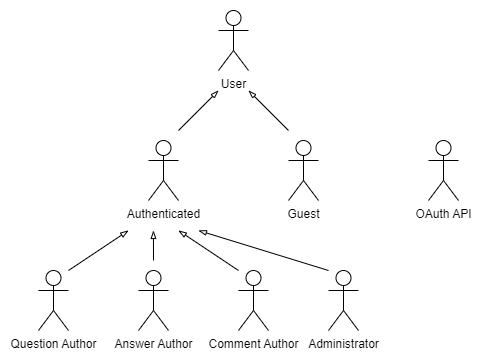

# ER: Requirements Specification Component

## Product vision

GameOn is committed to revolutionizing the online gaming landscape by creating a dynamic, unified platform that fosters collaboration, encourages knowledge-sharing, and celebrates gamers' contributions. In a world where information fragmentation and community engagement challenges persist, GameOn aims to be the go-to destination for gamers seeking connection and recognition within the gaming ecosystem.

## A1: GameOn

GameOn is being developed in response to the dynamic landscape of online gaming communities, which serve as the lifeblood of the gaming experience, where players congregate to share insights, strategies, and experiences. As the challenges of information fragmentation and community engagement continue to endure in the present, our system seeks to provide a unified platform that encourages collaboration, facilitates knowledge-sharing, and offers recognition for gamers' valuable contributions.

The main goal of the project is to cultivate a thriving gaming community by providing a platform where gamers can connect, share experiences, and engage with one another, while also creating a reliable and comprehensive source of gaming information that encompasses questions, answers, and expert insights. Additionally, we aim to recognize and reward gamers for their valuable contributions, enhancing motivation and participation within the community.

The website will encompass three distinct user roles, each with its own set of permissions and responsibilities. These will be guest users, authenticated users and administrators.

The **guest users** have the privilege of viewing content posted by other users. They can seamlessly navigate between various page sections, each specially designed for specific sub-communities based on interests or game genres. Furthermore, GameOn offers advanced search features to improve user experience, allowing users to search for posts using tags, as well as by frequency and popularity of posts. When they decide to become members of our community, they can create their profile and transition into authenticated users.

**Authenticated users** have the freedom to post questions, provide answers, comment and vote on existing posts, alongside the ability to view their submitted Q & A’s. Users whose answers receive notable recognition through peer votes may achieve certified user status, progressing through ranks such as Bronze, Gold, and Master. Additionally, they can actively monitor and track their contributions, as badges will be delivered when they accomplish certain tasks or reach specific milestones, encouraging positive behaviors and contributions to the open-source community.  

Lastly, **administrators** bear the responsibility of overseeing system management, with complete access and modification privileges, such as accepting or declining tags, creating new game sections, suspending user accounts, and removing articles that violate established rules. The administration team also has access to user and Q&A statistics, enabling them to monitor platform performance, user engagement, and Q&A effectiveness.

GameOn will feature a responsive design, ensuring users enjoy seamless browsing whether on a desktop, tablet, or smartphone. With intuitive navigation and a superb user interface, it guarantees a delightful experience across all devices.

## A2: Actors and User stories

This artifact contains the specification of the actors and their user stories, serving as agile documentation of the project’s requirements.

### 1. Actors

Figure 1: GameOn actors

| Identifier | Description |
| -------- | -------- |
| User | Generic user that has access to public information, such as posts and discussions, and consult or search for existing posts in the public forum | 
| Guest | Unauthenticated user that can register itself (sign-up) or sign-in in the system | 
| Authenticated User | Authenticated user that can ask, answer, comment and vote on posts, as well as see their posted Q & A's, track their contributions and earn badges | 
| Question Author | Authenticated user that can post, edit and delete their own questions | 
| Answer Author | Authenticated user that can provide answers on someone’s or on their own posts |
| Comment Author | Authenticated user that can comment on someone’s or on their own posts |
| Administrator | Administrator that is responsible for overseeing the system, accepting/declining tags, managing users, such as suspending accounts, and removing articles that are against established rules |

Table 1: GameOn actors description

### 2. User Stories

For the GameOn system, consider the user stories that are presented in the following sections.

#### 2.1. User

| Identifier |          Name          | Priority | Description |
| ---------- | ---------------------- | -------- | ----------  |
| US01       | See home page         | High     | As a User, I want to have access to a homepage, so that I can understand what the application is about.|
| US02       | View posted Q&A's      | High     | As a User, I want to view the questions and answers posted by other members so that I can learn from their experiences and knowledge.|
| US03       | Exact match search  | High     | As a User, I want an exact match search so that I can quickly find specific posts.|
| US04       | View top questions          | High | As a User, I want to be able to view the top questions, so that I can have easy access to the most popular questions. |
| US05       | Browse questions          | High | As a User, I want to browse questions easily so that I can discover a variety of topics related to games and expand my knowledge. |
| US06       | Full-text search        | Medium     | As a User, I want a full-text search functionality so that I can find information across all aspects of questions and answers.|
| US07       | Search filters          | Medium | As a User, I want to use search filters based on keywords so that I can narrow down my search results and quickly find specific information about games. |
| US08       | Search by tags          | Mediun | As a User, I want to be able to search questions by tags so that only the games I'm interested in appear. |
| US09       | View recent questions          | Medium | As a User, I want to be able to view recently made questions, so that I can easily stay updated on the latest discussions. |
| US10       | Browse questions by tags          | Medium | As a User, I want to browse questions by tags so that I can quickly find topics related to specific games or themes that match my interests. |
| US11       | See FAQ page         | Medium | As a User, I want to have access to a FAQ page, so that I can see the answers to the most frequently asked questions about the website. |
| US12       | See contact us page          | Medium | As a User, I want to have access to a contacts page, so that I can contact the team of the website. |
| US13       | Order seach results          | Medium | As a User, I want to be able to sort the search results using different filters so that I can find what I want easily. |
| US14       | View question details          | Medium | As a User, I want to be able to view question details, so that I can have a deeper knowledge about a question. |
| US15       | View user profiles         | Medium | As a User, I want to view user profiles, so that I can see information about that user. |
| US16       | Placeholders in Form Inputs         | Medium | As a User, I want placeholders in form inputs so that I can clearly understand what information is expected in each field.  |
| US17       | Contextual Error Messages         | Medium | As a User, I want contextual error messages so that I receive clear and specific error messages. |
| US18       | Contextual Help         | Medium | As a User,  I want contextual help so that I can access relevant guidance within the system. |

Table 2: User user stories

#### 2.2. Guest

| Identifier |          Name          | Priority | Description |
| ---------- | ---------------------- | -------- | ----------  |
| US19       | Sign-in        | High     | As a Guest, I want the option to create an account easily, so that I can become an active participant in the future.|
| US20       | Sign-up      | High     | As a Guest, I want to be able to authenticate into the system, so that I can post my own questions and answers.|

Table 3: Guest user stories

#### 2.3. Authenticated user

| Identifier |          Name          | Priority | Description |
| ---------- | ---------------------- | -------- | ----------  |
| US21       | Logout      | High     | As a User, I want to be able to sign out of my account. |
| US22       | View my profile     | High     | As a User, I want to be able to view my user profile so that I can keep it updated. |
| US23       | View my questions     | High     | As a User, I want to see my questions, so that I can easily track what I have been asking. |
| US24       | View my answers     | High     | As a User, I want to be able to view my answers, so that I can easily track my posts contribution. |
| US25       | Post questions    | High     | As a User, I want to post a question, so that I can seek guidance or information from the gaming community. |
| US26       | Post answers     | High     | As a User, I want to provide answers to questions asked by others, so that I can share my knowledge and help fellow gamers. |
| US27       | Edit question     | High     | As a User, I want to be able to edit my questions, so that I can correct mistakes or remove outdated information. |
| US28       | Edit answer     | High     | As a User, I want to be able to edit my answers so that I can revise and enhance my responses based on new information or feedback. |
| US29       | Delete question     | High     | As a User, I want to be able to delete questions, so that I can have control over the content I have posted. |
| US30       | Delete answer     | High | As a user, I want to be able to delete answers, so that I can have control over the content I have contributed. |
| US31      | Edit profile     | High     | As a User, I want to change profile information, so that I can keep it updated and relevant. |
| US32       | Vote on post     | Medium     |As a User, I want to upvote or downvote questions and answers, so that I can show my appreciation or my concerns for content and contribute to its visibility on the platform. |
| US33       | Comment on post     | Medium     | As a User, I want to be able to comment on questions and answers, so that I can engage in discussions and seek clarification. |
| US34       | Edit comment     | Medium     | As a User, I want to be able to edit my comments so that I can modify my responses for clarity, correctness, or relevance. |
| US35       | Edit profile picture    | Medium     | As a User, I want to be able to edit a profile picture, so that it can be updated. |
| US36       | Manage post visibility    | Medium     | As a User, I want to be able to manage a post's visibility, so that I can have control over who can see and interact with that post. |
| US37       | Mark Answer as Correct    | Medium    | As a User, I want to be able to mark an answer as correct so that other users can easily identify the most helpful and accurate solution. |
| US38       | Delete comment     | Medium    | As a user, I want to be able to delete comments, so that I can remove any inappropriate or outdated content. |
| US39       | Delete account      | Medium     | As a User, I want to be able to permanently delete my account.|
| US40       | Follow question     | Medium     | As a User, I want to be able to follow questions of my interest, and receive notifications when answers are posted.|
| US41       | Follow tags     | Medium     | As a User, I want to be able to follow specific games tags so that I am aware of the latest news. |
| US42       | Join game community     | Medium     | As a User, I want to join the community of games I like so that I can connect with like-minded gamers and share experiences. |
| US43       | Earn badge      | Medium     | As a User, I want to earn badges so that I can showcase my achievements within the community.|
| US44       | Rank upgrade      | Medium     | As a User, I want to achieve rank upgrades so that I can demonstrate my expertise and dedication.|
| US45       | Recover password      | Medium     | As a User, I want to recover my password when I forget it.|
| US46       | Notification of answers/comment     | Medium     | As a User, I want to receive notifications when someone answers or comments on my questions, so that I promptly access and benefit from the helpful responses.|
| US47       | Report inappropriate content      | Medium     | As a User, I want to report inappropriate or offensive content, so that I can help maintain a positive and respectful community environment.|
| US48         | Notification of votes on content | Medium | As a User, I want to receive notification of votes on content so that I can be aware of the reach of my content. |
| US49       | Edit question tags    | Medium     | As a User, I want to be able to edit question tags so that I can ensure questions are appropriately categorized. |
| US50       | Notification of badge awards     | Low     | As a User, I want to receive notifications of badge awards so that I promptly become aware of my achievements and milestones.|
| US51       | Notification of rank upgrades     | Low     | As a User, I want to receive notifications of rank upgrades so that I can celebrate my progress.|
| US52       | Notification of followed questions/tags | Low     | As a User, I want to receive notifications for followed questions and tags so that I can stay updated on discussions that matter to me.|

Table 4: Authenticated user user stories

#### 2.4. Administrator

| Identifier |          Name          | Priority | Description |
| ---------- | ---------------------- | -------- | ----------  |
| US53       | Block and unblock user accounts      | Medium     | As an administrator, I want to be able to block user accounts so that I can maintain a safe and respectful community environment .|
| US54       | Delete content      | Medium     | As an administrator, I want to be able to delete content, so that I can make sure that the application content follows the community guidelines.|
| US55       | Create game sections     | Medium     | As an administrator, I want to create game sections so that I can organize discussions and content effectively. |
| US56       | Manage tags     | Medium     | As an administrator, I want to manage tags so that I can ensure consistent categorization and organization of content across the application. |
| US57       | Delete user account | Medium | As an administrator, I want to be able to delete user accounts so that can make sure that the application users all follow the community guidelines. |
| US58 | Remove comments| Low | As an administrator, I want to remove comments, so that offensive comments do not exist in the application. |
| US59       | Notification of inappropriate content      | Low     | As an administrator, I want to be notified of reported content by users so that I can take appropriate actions.|
| US60       | User statistics     | Low     | As an administrator, I want to see the user statistics, such as number of posts, questions in the last period of time, so that I can keep track of what interests people have. |

Table 5: Administrator user stories

### 3. Supplementary Requirements

#### 3.1. Business rules
| Identifier |Name| Description |
| ---------- |--- | ----------  |
| BR01 |Administrator| Administrators are participating members of the community, i.e. can post or vote on questions or answers.|
| BR02 |Post edition| Questions and answers edited after being posted should have a clear indication of the editions.|
| BR03 |Badge award| Users will be able to earn badges for various activities on the platform when they accomplish certain tasks or reach specific milestones (e.g., posted 50 questions, provided 20 correct answers, ect). These achievements are meant to encourage positive behaviors and contributions to the open-source community.|
| BR04 |Ranking system| Users are assigned ranks based on their reputation, which is calculated from the likes and dislikes received on their questions and answers. The ranks are as follows:  1. Bronze Rank - Users with 0 to 30 likes;  2. Gold Rank - Users with 31 to 60 likes;  3. Master Rank - Users with 60 or more likes.|
| BR05 |Dates| The date of each question is always before its answers. |
| BR06 |Vote on own Q&A’s| A user can’t vote on its own questions or answers.|
| BR07 |Delete own account|If a user deletes their account, the history of their posts (questions, answers, and comments) must be retained to ensure that the record of all posts is not lost. |
| BR08 |Delete user account by admin| If an administrator deletes a user account, all its posts (questions, answers and comments) should also be deleted.|
| BR09 |Ban account| If an administrator bans a user account, all its posts (questions, answers, and comments) should no longer be visible to other users.|
| BR10 |Delete post| Once a post is deleted, all answers and comments to it associated are also deleted. |
| BR11 |Edit question/answer/comment| Questions/answers/comments can only be edited by its creator.|
| BR12 |Edit user profile| A user profile can only be edited by its user. |

Table 6: GameOn business requirements

#### 3.2. Technical requirements
| Identifier |Name| Description |
| ---------- |--- | ----------  |
| TR01 |Availability| The system must be available 99 percent of the time in each 24-hour period.|
| TR02 |Usability| The system should be simple and easy to use. GameOn is designed to be used by media consumers from all ages, with or without technical experience, so a very good usability is a critical requirement.|
| **TR03** |**Web application** | **The system should be implemented as a web application with dynamic pages (HTML5, JavaScript, CSS3 and PHP).**|
| TR04 |Portability| The server-side system should work across multiple platforms (Linux, Mac OS, etc.). GameOn is destined for personal use. To make it easily available to a large user base, it should be platform-independent.|
| **TR05** |**Security**| **The system shall protect information from unauthorized access through the use of an authentication and verification system.**|
| TR06 |Scalability| The system must be prepared to deal with the growth in the number of users and their actions.|
| TR07 |Robustness|The system must be prepared to handle and continue operating when runtime errors occur. |
| TR08 |Ethics| The system must respect the ethical principles in software development (for example, personal user details, or usage data, should not be collected nor shared without full acknowledgement and authorization from its owner).|
| **TR09** |**Database**| **The PostgreSQL database management system must be used.**|

Table 7: GameOn technical requirements

#### 3.3. Restrictions
| Identifier |Name| Description |
| ---------- |--- | ----------  |
| C01 |Age Restriction| Under age users should not be able to view questions about games with explicit and violent content.|
| C02 |Deadline| The application must be ready by the end of the semester.|

Table 8: GameOn restrictions

---

## A3: Information Architecture

### 1. Sitemap

The diagram below illustrates the unique pages within onlyFEUP and how they can be navigated or utilized. It provides a straightforward overview of the website's user experience process.

Figure 2: GameOn sitemap

### 2. Wireframes

The wireframes displayed below outline the layout and positioning of crucial interactive elements. 

#### UI01: Home Page

Figure 3: Homepage wireframe

1. Direct access to the search feature
2. Sidebar with main web pages to ease navigation
3. Sort filters to display questions in different orders. Questions may be shown from newest to oldest (New), most to least votes (Popular) or questions with less answers first (Unaswered)
4. Most popular game sections the user may want to join
5. Preview of a question

#### UI14: Q&A Page

Figure 4:  Q&A Page wireframe

1. Direct access to the search feature
2. Dropdown menu that allows access to the user profile, notifications and to sign out
3. Sidebar with main web pages to ease navigation
4. Breadcrumbs to help the user navigate
5. Sidebar with game sections
6. Button that opens a text field to let a user write a new answer
7. Sorting criteria for the answers to see the most recent or most voted
8. Button that opens a text field to let a user comment on an answer

#### UI13: Game Page 

Figure 5:  Game Page wireframe

1. Direct access to the search feature
2. Dropdown menu that allows access to the user profile, notifications and to sign out
3. Sidebar with main web pages to ease navigation
4. Breadcrumbs to help the user navigate
5. Button that opens a text field to let a user write a new question
6. Sort filters to display questions in different orders. Questions may be shown from newest to oldest (New), most to least votes (Popular) or questions with less answers first (Unaswered)
7. Preview of a question
8. Statistics about the game section to let users know the number of questions, answers, votes and members of that game section 
9. Button to join the game community
10. Section to show which users have contributed the most in the current game community

#### UI17: Statistics Page 

Figure 5:  Statistics Page wireframe

1. Direct access to the search feature
2. Dropdown menu that allows access to the user profile, notifications and to sign out
3. Sidebar with main web pages to ease navigation
4. Statistic graph in administrator area to demonstrate how many users were active in a month
5. Statistic graph in administrator area to show the number of questions made in each month
6. Statistic graph in administrator area to show which games have the most score
7. Statistic graph in administrator area to show which devices have been most used to play games.

---

## Revision history

No changes yet.

***
GROUP23143, 22/09/2023

* Ana Azevedo, up202108654@up.pt
* Catarina Canelas, up202103628@up.pt
* Gabriel Ferreira, up202108722@up.pt
* Luís Du, up202105385@up.pt