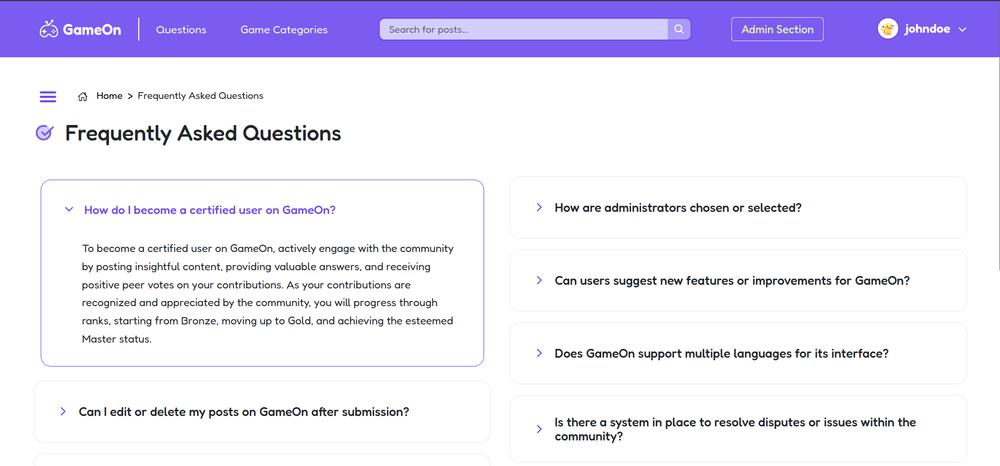
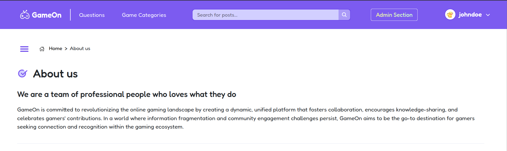
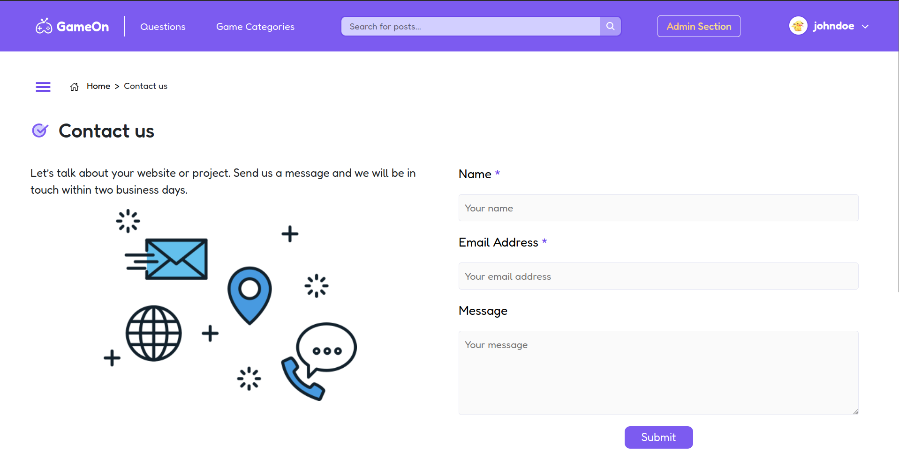
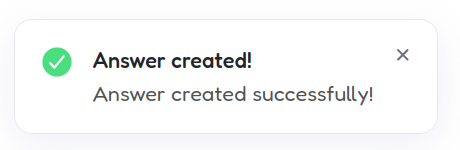
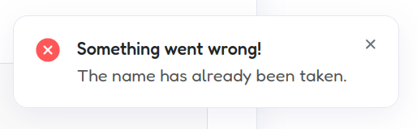
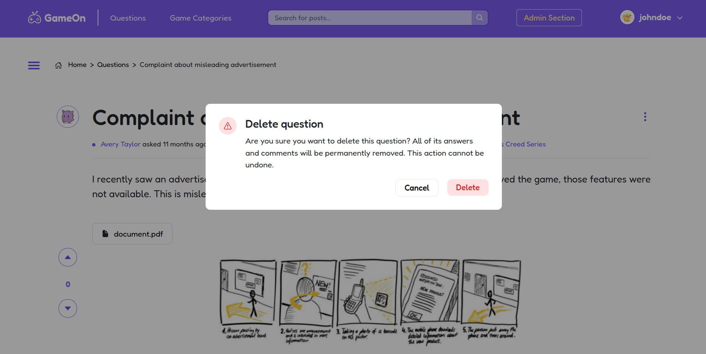
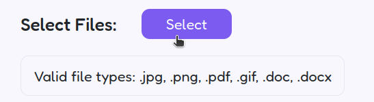
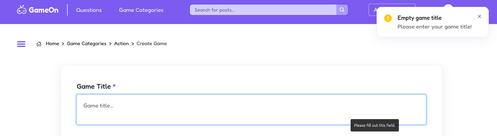
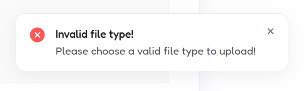

# PA: Product and Presentation

## A9: Product

GameOn is committed to revolutionizing the online gaming landscape by creating a dynamic, unified platform that fosters collaboration, encourages knowledge-sharing, and celebrates gamers' contributions.

In a world where information fragmentation and community engagement challenges persist, GameOn aims to be the go-to destination for gamers seeking connection and recognition within the gaming ecosystem.

### 1. Installation

The link to the release with the final version of the source code in the group's Git repository is available [here](https://lbaw23143.lbaw.fe.up.pt), in PA tag.

Full Docker command to launch the image available in the group's GitLab Container Registry using the production database:

```
docker run -it -p 8000:80 --name=lbaw23143 -e DB_DATABASE="lbaw23143" -e DB_SCHEMA="lbaw23143" -e DB_USERNAME="lbaw23143" -e DB_PASSWORD="LDBrcqvk" git.fe.up.pt:5050/lbaw/lbaw2324/lbaw23143
```

### 2. Usage

URL to the product: https://lbaw23143.lbaw.fe.up.pt

### 2.1. Administration Credentials

Administration URL: URL

| Username | Email               | Password |
| -------- | ------------------- | -------- |
| johndoe  | johndoe@example.com | 1234     |

### 2.2. User Credentials

| Type          | Username  | Email               | Password |
| ------------- | --------- | ------------------- | -------- |
| basic account | chloehall | chloehall@email.com | 1234     |

### 3. Application Help

Features related to Help were implemented as long as the rest of the main features.

#### 3.1. Static pages

- **FAQ Page**: You can explore our FAQ section by visiting [https://lbaw23143.lbaw.fe.up.pt/faq].



- **"About Us" Page**: Navigate to [https://lbaw23143.lbaw.fe.up.pt/about] to learn more about our organization.



- **"Contact Us" Page**: For inquiries or feedback, head to [https://lbaw23143.lbaw.fe.up.pt/contact] to get in touch with us directly.




#### 3.2. Alert messages

We've opted to integrate feedback cues such as error or success messages when users perform actions such as creating or editing questions, answers or comments.






#### 3.3. Confirmation popups

For critical actions like deleting a question or game, we've included confirmation messages.



#### 3.4. Hover tips

When hovering over elements like buttons, icons, or important UI components, informative tooltips appear, providing concise explanations or hints about their functionalities. 




### 4. Input Validation

#### 4.1. Server-side validation

We utilized the `Illuminate\Http\Request` functionality, which includes a `validate` function. This function offers various validation methods. We've implemented this feature to ensure that inputs in our forms, such as those for login, registration, and editing posts, undergo proper validation checks. Examples of this can be observed in the code snippets provided below:

```php
/* Validating a request to register a user */
 $request->validate([
    'name' => 'required|string|max:250',
    'username' => 'required|string|unique:users',
    'email' => 'required|email|max:250|unique:users',
    'password' => 'required|min:8|confirmed', 
]);
```

```php
/* Validating a request to create a question */$request->validate([
    'title' => 'required|max:256',
    'content' => 'required',
    'game_id' => 'nullable|exists:game,id'
]);
```

#### 4.2. Client-side validation

For client-side validation, we employed JavaScript to handle input verification directly within the user's browser. This involved using alert messages to prompt users about empty input fields or incorrect data types before they submit a form. Examples of the client-side validation implemented using JavaScript are shown below:

```js
function createGame(){
    event.preventDefault();
    const title = editGamePage.querySelector('#name');
    const description = editGamePage.querySelector('#description');
    if (title.value === ''){
        title.focus();
        createNotificationBox('Empty game title', 'Please enter your game title!', 'warning');
    }
    else if (description.value == '') {
        description.focus();
        createNotificationBox('Empty game description', 'Please enter your game description!', 'warning');
    } else {
        sendAjaxRequest('post', '/api/game', {name: title.value, description: description.value, category_id: category_id}, createGameHandler);
    }
}
```



<br>

```js
const imageExtentions = ["png", "jpeg", "jpg", "gif"];
const documentExtentions = ["doc", "docx", "txt", "pdf"];
const fileExtension = file.name.split('.').pop().toLowerCase();
if (!documentExtentions.includes(fileExtension)) {
    createNotificationBox('Invalid file type!', 'Please choose a valid file type to upload!', 'error');
}        
```



### 5. Check Accessibility and Usability

[Accessibility Checklist](accessibility.pdf): 18/18

[Usability Checklist](usability.pdf): 26/28

### 6. HTML & CSS Validation

HTML Validation (3 pages):
- [All questions page](questionsPage.pdf)
- [Single question page](questionPage.pdf)
- [Game category page](categoryPage.pdf)

[CSS Validation](css_validation.pdf)

### 7. Revisions to the Project

There are many revisions made to the project since the requirements specification stage:

#### Database Schema

- Two attributes were added to users table: 'profile_image' and 'remember_token';
- One attribute was added to game table: 'game_image';
- New table for question followers: 'question_followers'
- New table for question files: 'question_file';
- New table for answer files: 'answer_file';
- New trigger to update 'nr_members' of a game on insert in 'game_member' table

#### Triggers and indexes

- New trigger to set a user's content to 'anonymous' on delete
- Full text search index for posts revised: search with multiple levels of priorities

#### User Stories

- A new user story was added: view post activity, low-priority


### 8. Implementation Details

### 8.1. Libraries Used

#### 8.1.1. Bootstrap

[Bootstrap](https://getbootstrap.com) was used for front-end development, providing a responsive and mobile-first design framework. 

[Example of use](../resources/views/pages/category.blade.php): 

```html
 <div class="games-group d-flex flex-row justify-content-between pe-4">
    ...
</div>
```

#### 8.1.2. Ionicons

[Ionicons](https://ionic.io/ionicons/usage) was used for integrating high-quality, premium icons into the user interface. 

[Example of use](../resources/views/components/gameinfo.blade.php): 

```html
<ion-icon name="trash"></ion-icon>
```


#### 8.1.3. Chart.js

[Chart.js](https://www.chartjs.org) was used for creating dynamic and interactive charts within the application.

[Example of use](../public/js/admin.js):

```js
new Chart(gameChart, {
    type: 'bar',
    data: {
        labels: labels,
        datasets: [{
            data: data,
            backgroundColor: ['rgb(210, 207, 255)']
        }]
    },
    options: {
        indexAxis: 'y',
        plugins: {
            legend: {
                display: false
            },
        },
    }
});
```

#### 8.1.4. Mailtrap

[Mailtrap](https://mailtrap.io) was used for managing and testing email workflows during development.

[Example of use](../app/Mail/MailModel.php):

```php
public function envelope() {
    return new Envelope(
            from: new Address(env('MAIL_FROM_ADDRESS'), env('MAIL_FROM_NAME')),
            subject: 'Recover password',
        );
}
```

### 8.2 User Stories


| US Identifier | Name | Module | Priority | Team Members | State |
| --- | --- | --- | --- | --- | --- | 
| US01 | See home page | M02 | High | **Luís Du** | 100% |
| US02 | View posted Q&A's | M02 | High | ... | 100% |
| US03 | Exact match search | M03 | High | **Luís Du** | 100%
| US04 | View top questions | M03 | High | ... | 100% |
| US05 | Browse questions | M03 | High | **Luís Du** | 100% |
| US06 | Full-text search | M03 | High | **Luís Du** | 100% |
| US07 | View recent questions | M03 | High | ... | 100% |
| US08 | Order seach results | M03 | High | **Luís Du** | 100% |
| US09 | View question details | M03 | High | Ana Azevedo, **Gabriel Ferreira** | 100% |
| US10 | View user profiles | M02 | High | **Catarina Canelas** | 100% |
| US11 | Placeholders in Form Inputs | M02 | High | Ana Azevedo, **Catarina Canelas**, **Gabriel Ferreira**, **Luís Du** | 100% |
| US12 | Search filters | M03 | Medium | **Luís Du** | 100% |
| US13 | Search by tags | M03 | Medium | ... | 100% |
| US14 | Browse questions by tags | M03 | Medium | ... | 100% |
| US15 | See FAQ page | M02 | Medium | **Luís Du** | 100% |
| US16 | See contact us page | M02 | Medium | **Luís Du** | 100% |
| US17 | Contextual Error Messages | M02 | Medium | Ana Azevedo, **Catarina Canelas**, **Gabriel Ferreira**, **Luís Du** | 100% |
| US18 | Contextual Help | M02 | Medium | ? | 100% |
| US19 | Sign-up | M01 | High | **Luís Du** | 100% |
| US20 | Sign-in | M01 | High | **Luís Du** | 100% |
| US21 | OAuth API Sign-up | M01 | Low | **Gabriel Ferreira** | 100% |
| US22 | OAuth API Sign-in | M01 | Low | **Gabriel Ferreira** | 100% |
| US23 | Logout | M01 | High | **Luís Du** | 100% |
| US24 | View my profile | M02 | High | **Catarina Canelas** | 100% |
| US25 | View my questions | M02 | High | **Catarina Canelas** | 100% |
| US26 | View my answers | M02 | High | **Catarina Canelas** | 100% |
| US27 | Post questions | M03 | High | Ana Azevedo, **Gabriel Ferreira** | 100% |
| US28 | Post answers | M03 | High | Ana Azevedo, **Gabriel Ferreira** | 100% |
| US29 | Edit question | M03 | High | **Catarina Canelas**, Luís Du | 100% |
| US30 | Edit answer | M03 | High | **Catarina Canelas**, Luís Du | 100% |
| US31 | Delete question | M03 | High | **Catarina Canelas** | 100% |
| US32 | Delete answer | M03 | High | **Catarina Canelas** | 100% |
| US33 | Edit profile | M02 | High | **Catarina Canelas** | 100% |
| US34 | Vote on post | M03 | High |  **Gabriel Ferreira** | 100% |
| US35 | Comment on post | M03 | High | Ana Azevedo, **Gabriel Ferreira** | 100% |
| US36 | Edit comment | M03 | Medium | ... | 100% |
| US37 | Edit profile picture | M02 | Medium | **Luís Du** | 100% |
| US38 | Manage post visibility | M03 | Medium | **Luís Du** | 100% |
| US39 | Mark Answer as Correct | M03 | Medium | **Luís Du** | 100% |
| US40 | Delete comment | M03 | Medium | ... | 100% |
| US41 | Delete account | M05 | Medium | ... | 100% |
| US42 | Follow question | M02 | Medium | Ana Azevedo | 100% |
| US43 | Follow tags | M02 | Medium | Ana Azevedo | 100% |
| US44 | Join game community | M04 | Medium | Ana Azevedo | 100% |
| US45 | Earn badge | M02 | Medium | Ana Azevedo | 100% | 
| US46 | Rank upgrade | M02 | Medium | Ana Azevedo | 100% | 
| US47 | Recover password | M01 | Medium | **Luís Du** | 100% |
| US48 | Notification of answers/comment | M03 | Medium | Ana Azevedo | 100% |
| US49 | Report inappropriate content | M03 | Medium | **Gabriel Ferreira** | 100% |
| US50 | Notification of votes on content | M03 | Medium | Ana Azevedo | 100% |
| US51 | Edit question tags | M03 | Medium | **Luís Du** | 100% |
| US52 | Notification of badge awards | M03 | Low | Ana Azevedo | 100% |
| US53 | Notification of rank upgrades | M03 | Low | Ana Azevedo | 100% |
| US54 | Notification of followed questions/tags | M03 | Low | Ana Azevedo | 100% |
| US55 | Block and unblock user accounts | M05 | Medium | **Luís Du** | 100% |
| US56 | Delete content | M05 | Medium | **Catarina Canelas** | 100% |
| US57 | Create game sections | M05 | Medium | **Catarina Canelas** | 100% |
| US58 | Manage tags | M05 | Medium | **Catarina Canelas** | 100% |
| US59 | Delete user account | M05 | Medium | **Catarina Canelas** | 100% |
| US60 | Remove comments | M05 | Medium | **Catarina Canelas** | 100% |
| US61 | Notification of inappropriate content | M05 | Low | Ana Azevedo | 100% |
| US62 | User statistics | M05 | Low | **Luís Du** | 100% |
| US63 | Create Games | M05 | Medium | **Catarina Canelas** | 100% |
| US64 | Handle Reports | M05 | Medium | **Gabriel Ferreira** | 100% |
| US65 | Manage Game Categories | M05 | Medium | **Luís Du** | 100% |
| US66 | Manage Games | M05 | Medium | **Luís Du** | 100% |
| US67 | Remember Me | M02 | Medium | **Luís Du** | 100% |
| US67 | View post activity | M02 | Low | **Luís Du** | 100% |


## A10: Presentation

### 1. Product presentation

GameOn is being developed in response to the dynamic landscape of online gaming communities, which serve as the lifeblood of the gaming experience, where players congregate to share insights, strategies, and experiences. The main goal of the project is to cultivate a thriving gaming community by providing a platform where gamers can connect, share experiences, and engage with one another, while also creating a reliable and comprehensive source of gaming information that encompasses questions, answers, and expert insights. The website will encompass three distinct user roles, each with its own set of permissions and responsibilities. These will be guest users, authenticated users and administrators.

**Guest users** can explore content across various genres and specialized sections through an advanced search feature.
**Authenticated users** engage actively by posting questions, providing answers, commenting, and earning recognition and badges based on their contributions and achievements. **Administrators** oversee system management, handling tasks like tag management, content moderation, and monitoring platform performance through user and Q&A statistics. This structure encourages engagement, rewards contributions, and ensures effective platform governance.

URL to the product: https://lbaw23143.lbaw.fe.up.pt 


### 2. Video presentation

[Presentation Video](../docs/lbaw23143.mp4)

### Revision history

No changes made since the first submission.

---

GROUP23143, 21/12/2023

- Ana Azevedo, up202108654@up.pt
- Catarina Canelas, up202103628@up.pt
- Gabriel Ferreira, up202108722@up.pt
- Luís Du, up202105385@up.pt
